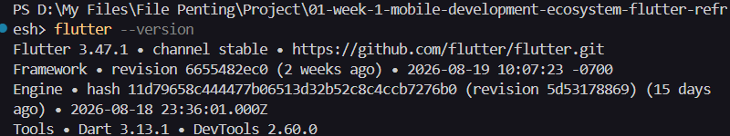
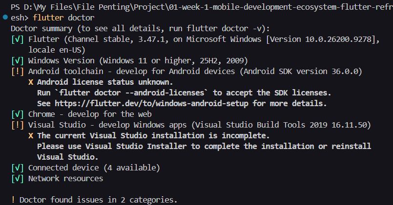
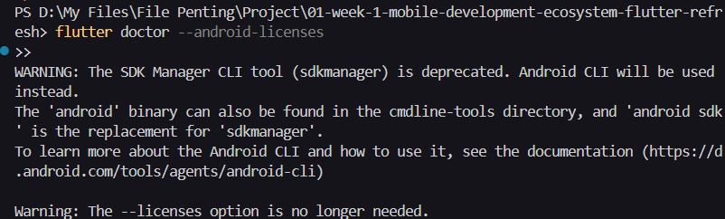
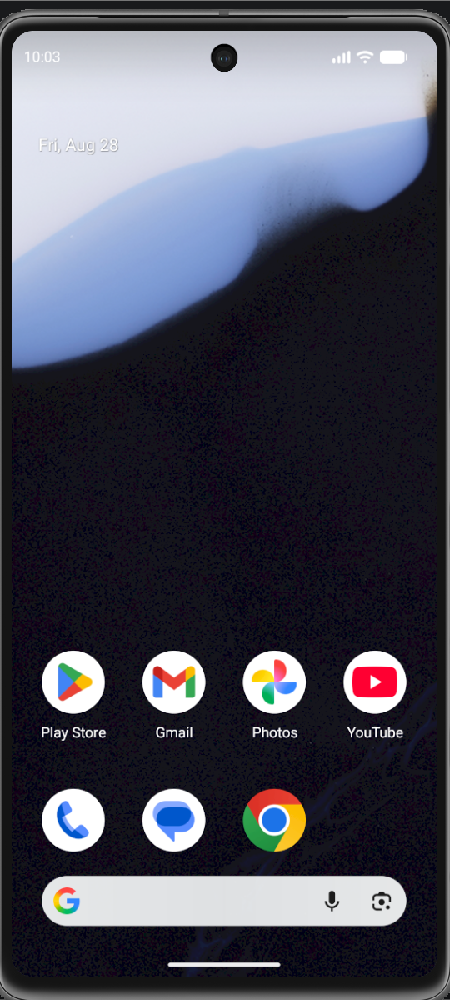
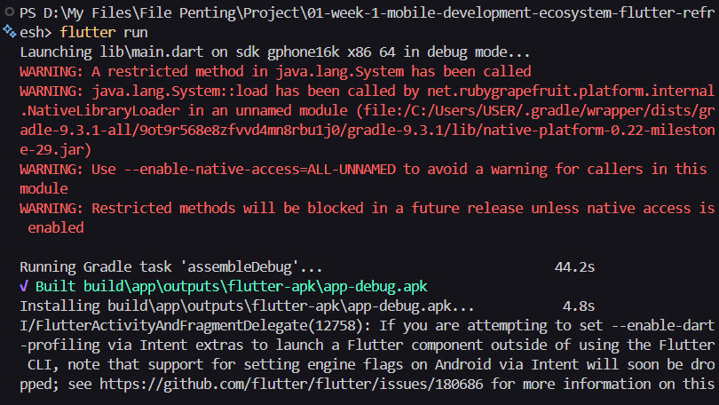
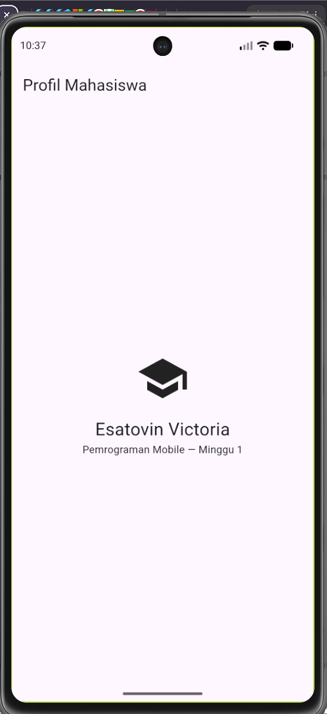
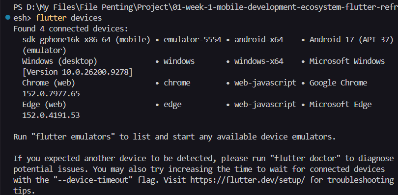
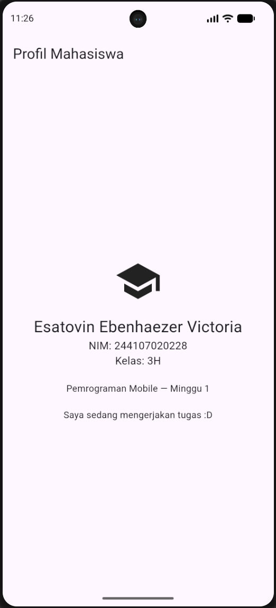

# 01-week-1-mobile-development-ecosystem-flutter-refresh

## Tujuan:
1.  Menjelaskan evolusi pengembangan mobile serta perbedaan native, hybrid, dan cross-platform;
2.  Menjelaskan arsitektur Flutter, peran Dart, struktur proyek, dan widget tree;
3.  Mengulang dasar Dart: variabel, tipe data, fungsi, class, dan null safety;
4.  Menyiapkan Flutter, Android SDK, emulator atau perangkat fisik, lalu menjalankan aplikasi pertama;
5.  Mengubah UI awal Flutter dan menyimpan hasilnya pada repository Git pribadi.

## Fitur Utama
UI Profil Mahasiswa

## Stack Teknologi
1.  Flutter
2.  Dart
3.  Github
4.  Android SDK

## Cara Menjalankan
1.  Menginstall semua environment yang diperlukan sesuai dengan ketentuan

2.  Menjalankan perintah flutter --version untuk mengecek flutter apakah sudah terinstall

    Berikut merupakan bukti screenshot untuk perintah flutter --version.
    

3.  Menjalankan perintah flutter doctor untuk mengecek isu dan konflik apabila ada

    Berikut merupakan bukti screenshot untuk perintah flutter doctor.
    

4.  Menjalankan perintah flutter doctor --android-licenses untuk mendapatkan license android

    Berikut merupakan bukti screenshot untuk perintah flutter doctor --android-licenses.
    

5.  Menjalankan virtual device (Pixel 7 pada praktikum saya) pada Android Studio

    Berikut merupakan bukti screenshot untuk virtual device Pixel 7 pada android studio
    

6.  Menjalankan perintah flutter run untuk menjalankan aplikasi pada virtual device

    Berikut merupakan bukti screenshot untuk perintah flutter run
    
    

7.  Memperbarui kode pada folder lib/main.dart kemudian dilakukan hot reload untuk mengecek perubahan pada tampilan virtual device

    Berikut merupakan bukti screenshot untuk dilakukan hot reload setelah terdapat perubahan
    

## Hasil dicapai
1.  Konfigurasi environment berjalan
2.  Aplikasi dapat berjalan
3.  Terdapat dokumentasi pada Git

## Checklist verifikasi
-   flutter doctor tidak memiliki masalah yang menghambat target Android.

    Bukti screenshot:
    

-   flutter devices mendeteksi emulator/perangkat fisik.

    Bukti screenshot:
    

-   Aplikasi berjalan dan UI default telah diganti dengan profil sederhana.

    Bukti screenshot:
    

-   Anda dapat menjelaskan perbedaan hot reload dan hot restart.

    Perbedaan hot reload dan hot restart terletak pada cara kerja pembaruan aplikasi terhadap kode program. Pada hot reload, perubahan kode program dilakukan tanpa menghapus state, sehingga data yang sudah dimasukkan tidak hilang dan posisi layar tidak berubah. Sedangkan hot restart, menghapus state dan menjalankan ulang aplikasi sehingga memgembalikan aplikasi ke kondisi awal.

-   Repository remote berisi source code, README, screenshot, dan riwayat commit.

## Mini Assignment
Membuat aplikasi  Profil Mahasiswa berdasarkan praktikum, dengan menambahkan NIM dan satu informasi tambahan menggunakan widget dasar. Berikut merupakan bukti screenshot mengenai aplikasi yang telah dibuat.

## Kendala Setup
Saya mengalami kendala setup ketika menginstall Flutter pertama kali dikarenakan saya menempatkan folder flutter nya di OneDrive, yang dimana direktori/path nya memiliki karakter jepang yang tidak bisa dibaca oleh sistem, sehingga saya panik ketika tidak bisa memanggil flutter pada CLI.

## Refleksi
1.  Kapan native lebih tepat dipilih daripada cross-platform?

    Jawaban: Native lebih tepat dipilih daripada cross-platform apabila pengembang aplikasi berencana untuk membuat aplikasi yang ditujukan pada satu tipe device saja, yakni Android maupun iOS. Hal ini dikarekanan native memiliki kode dan UI khusus untuk setipa platform dan akses API yang langsung. 

2.  Bagaimana perubahan state berhubungan dengan widget tree dan UI deklaratif?

    Jawaban: Ketika terjadi perubahan state di dalam aplikasi Flutter akan menandai widget yang bersangkutan dan memicu pengerjaan ulang metode build(). Proses ini menghasilkan pembentukan Widget Tree baru, yang selanjutnya akan dibandingkan untuk mendeteksi perubahan konfigurasi secara presisi. Hal ini membuat proses pembuatan ulang UI tetap berjalan responsif.

3.  Mengapa commit kecil dengan pesan jelas bermanfaat bagi pekerjaan tim dan portfolio?

    Jawaban: Commit kecil dengan pesan jelas bermanfaat bagi tim karena tim dapat memahami konteks/perubahan kode yang dimaksud oleh individu, yang nantinya dapat ditindaklanjuti oleh rekan tim sehingga menghindari miskomunikasi dan kesalahpahaman.