# 02-week-2-declarative-ui-responsive-design

## Tujuan:
1. Menjelaskan prinsip declarative UI dan hubungan antara widget, konfigurasi, serta state.
2. Menggunakan StatelessWidget, StatefulWidget, Container, Row, Column, dan Expanded.
3. Membedakan komponen Material 3 dan Cupertino untuk kebutuhan platform yang berbeda.
4. Membangun layout responsif untuk ukuran layar mobile dan tablet.
5. Menerapkan theme, dark mode, styling, dan aksesibilitas dasar.

## Fitur Utama
Responsif Design

## Layout Sederhana (Warm-up)
1. Menghapus Expanded para baris nama, kemudian mengamati peringatan overflow, dan mengembalikannya setelah itu.

    Bukti screenshot:

    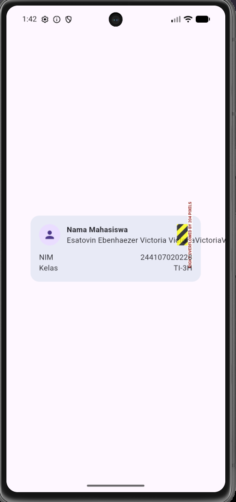

2. Mengganti mainAxisSize: MainAxisSize.min menjadi nilai default (max) dan mengamati perubahan tinggi kartu.

    Bukti screenshot:

    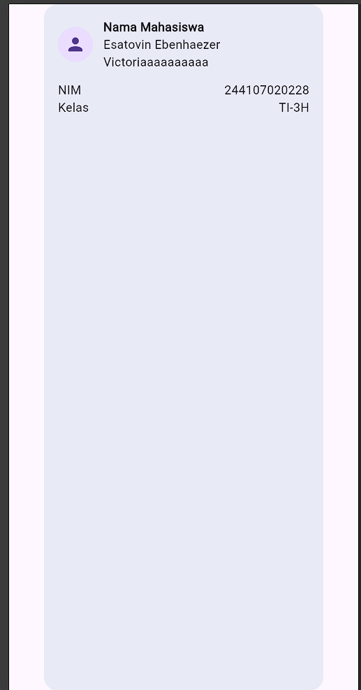

3. Menambahkan satu baris data email baru.

    Bukti screenshot:

    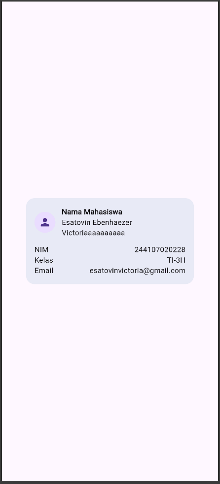

## Dashboard Responsif
1. Menyiapkan project, run, memodifikasi kode program untuk widget statis (stateless widget).

    Bukti screenshot:

    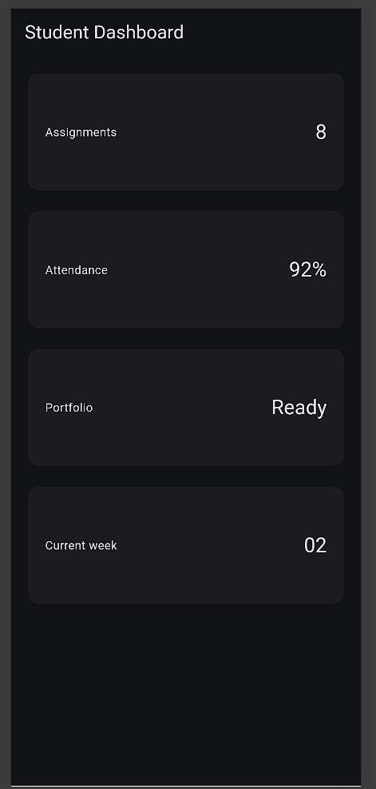

2. Menambahkan interaksi StatefulWidget dan Cupertino Switch.

    Terlihat pada tampilan aplikasi kini memiliki sebuah switch yang dimana apabila switch untuk logo bulan, maka tampilan berubah menjadi dark mode. Sedangkan ketika di toggle menjadi off, maka tampilan aplikasi menjadi light mode.

    Bukti screenshot:

    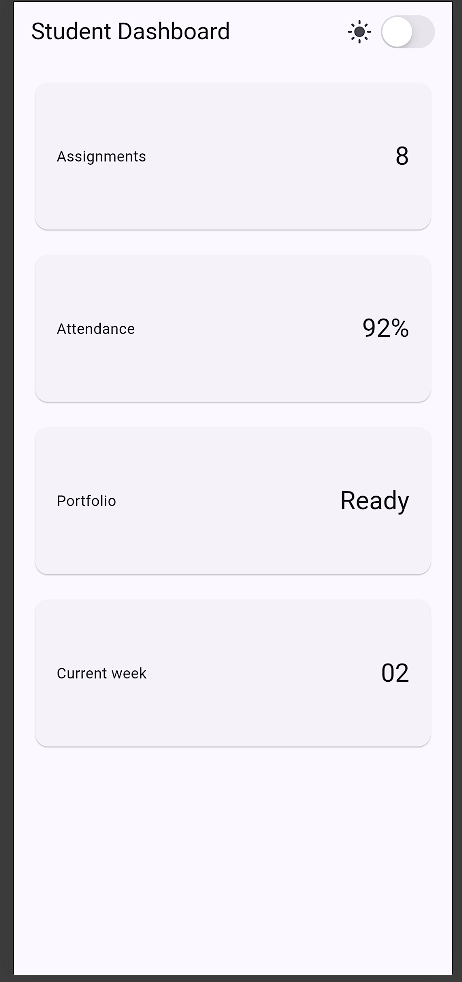

    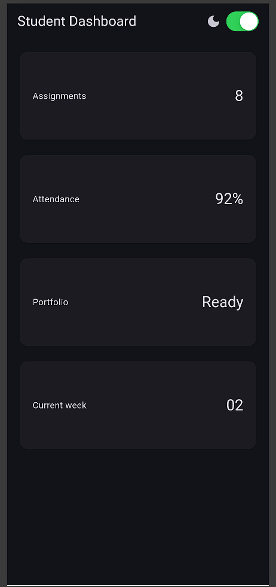

    Perbandingan dengan Switch Adaptive:

    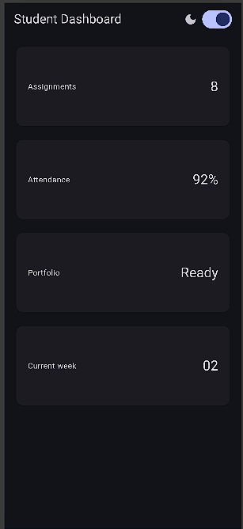

    

    Terlihat perbedaan pada Cupertino dan Switch Adaptive adalah warna untuk toggle light mode dan dark mode.

## Eksperimen Layout

1. Ubah breakpoint dari 700 menjadi nilai lain dan amati perubahan jumlah kolom.

    Pada kasus ini, saya mengganti nilai breakpoint yang semula 700 menjadi 400 sesuai dengan kode program berikut:

    final columns = constraints.maxWidth >= 400 ? 2 : 1;

    Hal ini berarti breakpoint untuk memecah digunakan 2 kolom atau 1 kolom pada tampilan UI yang semula untuk perangkat dengan lebar layar minimal 700 pixel menjadi 400 pixel, Sehingga tampilan untuk perangkat dengan resolusi 412x915 menjadi 2 kolom sesuai dengan gambar berikut.

    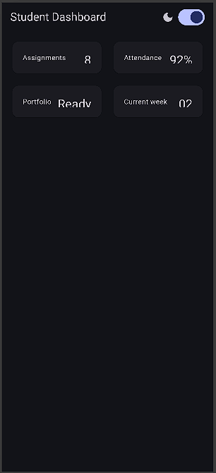

2. Ubah themeMode menjadi ThemeMode.dark, lalu kembalikan ke ThemeMode.system.

    Pada soal ini, kode program diubah agar tampilan aplikasi diubah statis menjadi dark mode saja sesuai kode program berikut:
    
    themeMode: ThemeMode.dark

    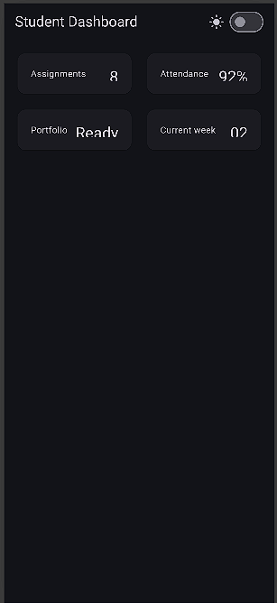

    kemudian dikembalikan lagi menjadi setelan default dari perangkat (perangkat saya memiliki tema gelap), sesuai dengan kode program berikut:

    themeMode: ThemeMode.system,

    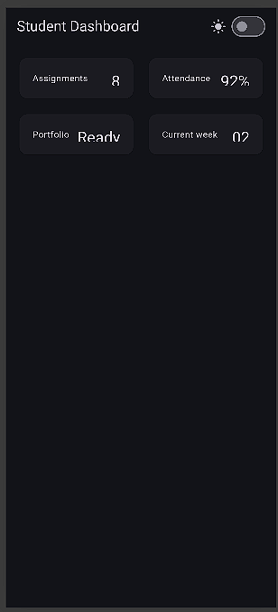

3. Uji aplikasi dengan ukuran layar emulator yang berbeda.

    Berikut merupakan tampilan apliklasi pada perangkat iPhone SE. Terlihat bahwa tampilan pada iPhone SE, kolom yang ditampilkan hanya 1 kolom, dan default dari tema sistem adalah tema gelap.

    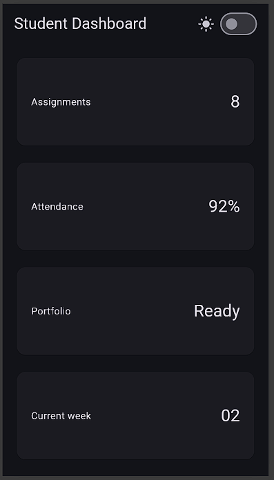

4. Tambahkan Semantics atau label yang bermakna pada elemen yang penting bagi screen reader.

    Menambahkan kode program semantics pada toggle mode gelap dan terang sesuai dengan kode program berikut:

    Semantics(
        label: 'Opsi Mode Gelap',
        hint: 'Geser Untuk Mengubah Tema Aplikasi',
        toggled: isDark,
        child: Switch.adaptive(
        value: isDark, 
        onChanged: onDarkChange,
    ),

    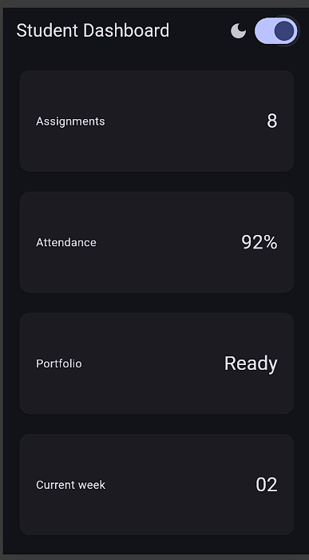

## Tugas Utama
Mengembangkan dashboard menjadi Academic Overview sesuai dengan ketentuan.
Berikut merupakan tampilan aplikasi setelah dikembangkan.

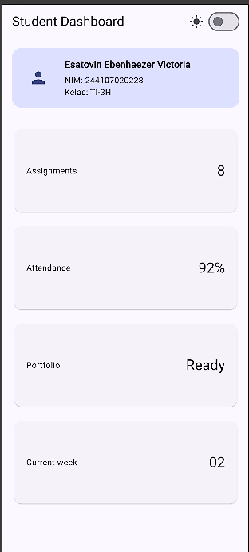

Tampilan pada layar sempit (414x896):

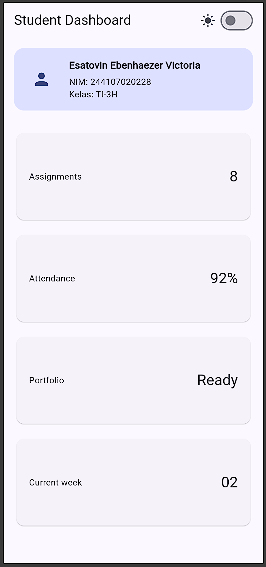

Tampilan pada layar lebar (1024x1366):

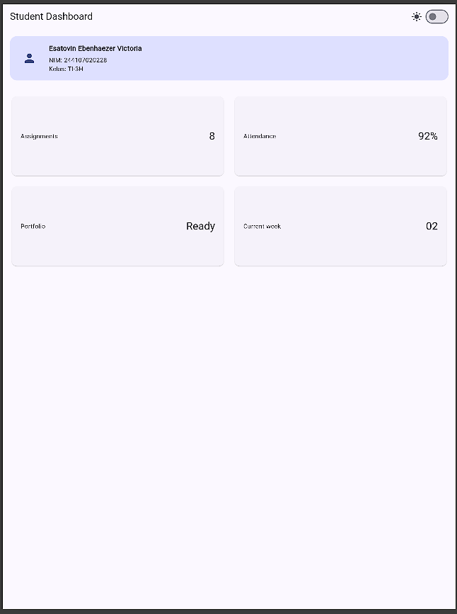

## AI Prompt Challenge
Menggunakan AI (Gemini) untuk membandingkan dua alternatif tata letak.

1. Prompt Desain

    Prompt: Bandingkan dua tata letak dashboard akademik untuk Flutter: versi GridView dan versi LayoutBuilder + Column. Jelaskan trade-off responsif dan aksesibilitasnya.

    Jawaban: 
    Kedua pendekatan ini memiliki keunggulan yang berbeda tergantung pada target perangkat dan tingkat fleksibilitas layout yang dibutuhkan.

    a. Trade-Off Responsif

    --> LayoutBuilder + Column/GridView Dynamic

    Kelebihan: Sangat adaptif terhadap perubahan ukuran layar (breakpoint). Memastikan tampilan di perangkat seluler (portrait) tidak sesak, sekaligus memanfaatkan ruang kosong pada tablet atau desktop (landscape).

    Kekurangan: Rasio childAspectRatio: 2.6 pada GridView tetap bisa menyebabkan konten terpotong (overflow) jika ukuran font pengguna dinaikkan secara ekstrem pada layar berukuran tanggung.

    --> GridView Standar (Tanpa Breakpoint)

    Kelebihan: Penulisan kode lebih sederhana dan langsung menangani scrolling bawaan secara optimal.

    Kekurangan: Layout terlihat terlalu rapat pada layar kecil atau terlalu renggang/gepeng pada layar besar jika jumlah kolom tidak disesuaikan dengan maxWidth.

    b. Trade-Off Aksesibilitas (Accessibility & A11y)

    --> Skalabilitas Teks (Text Scaling)

    Pada GridView yang menggunakan childAspectRatio, meningkatkan ukuran font sistem (misal: fitur Accessibility pada Android/iOS) sering kali memicu error Yellow-Black Striped Overflow karena tinggi card dikunci oleh rasio.

    Pendekatan layout berbasis Column atau Flex murni jauh lebih ramah aksesibilitas karena tinggi widget dapat mengembang (auto-expand) mengikuti ukuran teks.

    --> Navigasi Screen Reader (TalkBack / VoiceOver)

    GridView secara otomatis membacakan informasi struktur kisi kepada pengguna tunanetra (misal: "Menampilkan item 1 dari 4 dalam kolom 1 baris 1").

    Penggunaan LayoutBuilder yang dikombinasikan dengan pembungkus Semantics (seperti pada switch tema di kode Anda) memperjelas konteks elemen interaktif saat berpindah dari mode 1 kolom ke 2 kolom.

    Keputusan dipilih: Layout Builder + GridView

    Alasan Teknis:

    Responsif Optimal: Penggunaan LayoutBuilder memberi fleksibilitas untuk mengubah jumlah kolom (crossAxisCount: 1 di HP, 2 di tablet/desktop) sehingga tata letak tidak tertekan pada layar sempit.

    Scroll & Efisiensi: Mempertahankan GridView di dalam Expanded menjaga efisiensi memori dan perilaku scrolling bawaan Flutter saat daftar kartu bertambah banyak.

    Bukti Verifikasi:

    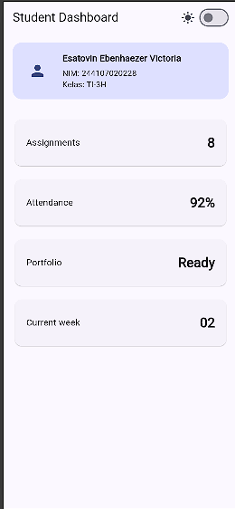

2. Prompt Penguatan Konsep

    Prompt: Jelaskan kapan penggunaan Expanded justru menyebabkan overflow di dalam Row, beri contoh kode yang gagal dan perbaikannya

    Jawaban: 
    Expanded pada dasarnya berfungsi untuk menyuruh widget anak mengisi sisa ruang kosong yang tersedia di dalam Row atau Column.

    Expanded justru akan menyebabkan overflow (terutama error RenderFlex overflowed / Yellow-Black Striped) ketika dikombinasikan dengan widget yang membutuhkan lebar tidak terbatas (unconstrained width) secara horizontal atau dimasukkan ke dalam scroll view horizontal.

    Bukti Verifikasi:

    Kode Program & Tampilan saat overflow pada Expanded:

    class UnstableProfileHeader extends StatelessWidget {
    const UnstableProfileHeader({super.key});

    @override
    Widget build(BuildContext context) {
        return Container(
        margin: const EdgeInsets.all(16),
        padding: const EdgeInsets.all(16),
        decoration: BoxDecoration(
            color: Theme.of(context).colorScheme.primaryContainer,
            borderRadius: BorderRadius.circular(16),
        ),
        // PERMASALAHAN: ScrollView Horizontal membuat lebar Row menjadi tak terbatas (infinity)
        child: SingleChildScrollView(
            scrollDirection: Axis.horizontal,
            child: Row(
            children: [
                const CircleAvatar(
                radius: 28,
                child: Icon(Icons.person, size: 32),
                ),
                const SizedBox(width: 16),
                // ERROR: Expanded bingung harus mengambil porsi berapa dari lebar tak terbatas!
                Expanded(
                child: Column(
                    crossAxisAlignment: CrossAxisAlignment.start,
                    children: [
                    Text(
                        'Esatovin Ebenhaezer Victoria',
                        style: Theme.of(context).textTheme.titleMedium?.copyWith(
                            fontWeight: FontWeight.bold,
                            ),
                    ),
                    const SizedBox(height: 4),
                    const Text('NIM: 244107020228'),
                    const Text('Kelas: TI-3H'),
                    ],
                ),
                ),
            ],
            ),
        ),
        );
    }
    }

    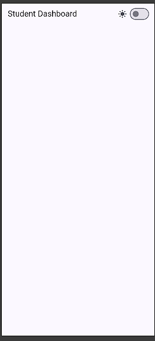

    Kode program & tampilan untuk solusi dari overflow pada Expanded:

    class FixedProfileHeader extends StatelessWidget {
    const FixedProfileHeader({super.key});

    @override
    Widget build(BuildContext context) {
        return Container(
        margin: const EdgeInsets.all(16),
        padding: const EdgeInsets.all(16),
        decoration: BoxDecoration(
            color: Theme.of(context).colorScheme.primaryContainer,
            borderRadius: BorderRadius.circular(16),
        ),
        child: SingleChildScrollView(
            scrollDirection: Axis.horizontal,
            child: Row(
            children: [
                const CircleAvatar(
                radius: 28,
                child: Icon(Icons.person, size: 32),
                ),
                const SizedBox(width: 16),
                // SOLUSI: Hapus Expanded, gunakan Column biasa tanpa pembungkus flex
                Column(
                crossAxisAlignment: CrossAxisAlignment.start,
                children: [
                    Text(
                    'Esatovin Ebenhaezer Victoria',
                    style: Theme.of(context).textTheme.titleMedium?.copyWith(
                            fontWeight: FontWeight.bold,
                        ),
                    ),
                    const SizedBox(height: 4),
                    const Text('NIM: 244107020228'),
                    const Text('Kelas: TI-3H'),
                ],
                ),
            ],
            ),
        ),
        );
    }
    }

    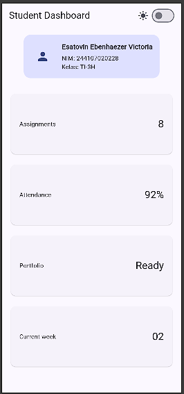

3. Verification Prompt

    Prompt: Periksa kembali rekomendasi layout di atas: apakah tetap responsif di bawah 600px, apakah mengurangi aksesibilitas, dan apakah ada widget yang tidak tersedia di Flutter stabil saat ini?

    Jawaban: 

    1. Ketersediaan Widget di Flutter Stabil
    Semua widget yang digunakan resmi & stabil. LayoutBuilder, GridView.builder, SliverGridDelegateWithFixedCrossAxisCount, mainAxisExtent, hingga Switch.adaptive adalah fitur bawaan Flutter SDK (sudah ada sejak Flutter 2.x).

    Tidak ada third-party package atau API eksperimental yang dapat rusak di versi Flutter stabil saat ini.

    2. Responsivitas di Bawah 600px (Layar HP Sempit)
    Responsif: Breakpoint constraints.maxWidth >= 700 memastikan bahwa pada lebar layar di bawah 600px, crossAxisCount otomatis bernilai 1. Kartu akan membentang mengikuti lebar layar HP.

    Catatan Kecil: Penggunaan nilai tinggi tetap mainAxisExtent: 90 pada 1 kolom bekerja sangat baik untuk teks pendek standar. Namun, di layar HP yang sangat sempit (misal 320px–360px), jika isi kartu bertambah panjang, margin/padding di dalam kartu perlu diperhatikan agar teks tidak terpotong secara vertikal.

    3. Dampak Terhadap Aksesibilitas (A11y)
    Kelebihan (Meningkat):

    Mengatasi Bug Font Scaling: Dengan mainAxisExtent, kartu tidak akan gepeng jika rasio layar berubah.

    Informasi Grid: GridView memberikan konteks struktur posisi item yang jelas bagi pengguna penyandang tunanetra saat menggunakan Screen Reader (TalkBack/VoiceOver).

    Potensi Masalah (Pencegahan Overflow):

    Mengunci tinggi kartu (mainAxisExtent: 90) dapat memicu overflow vertikal jika pengguna mengaktifkan Large Text / Dynamic Type hingga 150%–200% di pengaturan aksesibilitas HP.

    Solusi Penyelamat Aksesibilitas: Di dalam DashboardCard, judul dibatasi maxLines: 2 dan overflow: TextOverflow.ellipsis agar tata letak tidak rusak saat teks membesar.

    Bukti Verifikasi:

    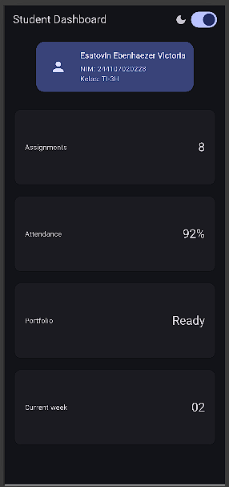

4. Dokumentasi

## Refactoring Challenge
1. Ekstrak kartu informasi menjadi widget reusable (misal InfoCard) yang menerima title dan value, sehingga tidak ada duplikasi widget.

    Memodifikasi kode program sehingga menjadi widget reusable, yang dimana sudah diterapkan pada class DashboardCard. Untuk soal ini, saya ubah deklarasi dan inisialisasi Dashboard menjadi infoCard

    class InfoCard extends StatelessWidget {
        const InfoCard({required this.title, required this.value, super.key});
        final String title;
        final String value;
    }

2. Ganti warna dan ukuran yang di-hardcode dengan Theme.of(context) agar mengikuti tema terang/gelap secara otomatis.

    Pada soal ini, sudah diterapkan untuk Theme.of(context) agar mengikuti tema terang dan gelap

    Contoh kode program:
    color: Theme.of(context).colorScheme.primaryContainer,
    style: Theme.of(context).textTheme.titleMedium?.copyWith(
        fontWeight: FontWeight.bold,
        ),

3. Pindahkan breakpoint ke satu konstanta bernama (misal const kWideBreakpoint = 700;) agar hanya didefinisikan satu kali.

    Pada soal ini, saya membuat variabel baru untuk mendefinisikan minimal lebar pixel untuk memecah jumlah column.
    
    Kode program:
    final triggerWideBreakpoint = 700;
    final columns = constraints.maxWidth >= triggerWideBreakpoint ? 2 : 1;

4. Jalankan flutter analyze dan pastikan tidak ada error maupun warning baru.

    Bukti screenshot:

    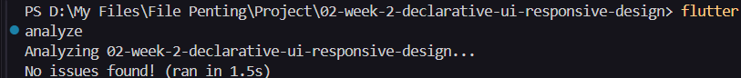

## Testing Dasar
Menambahkan widget test, kemudian menjalankan flutter test

Hasil flutter test:

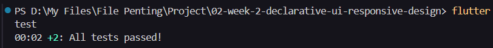

## Checklist Verifikasi
1. flutter analyze tidak menghasilkan error.

    Screenshot:

    

2. flutter test lulus semua widget test responsif.

    Screenshot:

    

3. Aplikasi dapat dijalankan pada ukuran layar sempit dan lebar.

    Screenshot:
    Layar sempit:

    

    Layar lebar:

    

4. Dark mode memiliki kontras dan teks yang terbaca.

    

5. Struktur widget dapat dijelaskan saat code review.
6. Screenshot, folder test/, dan README sudah tersimpan pada folder tugas Week 2.

## Refleksi
1. Apa perbedaan cara berpikir imperative dan declarative saat membangun UI?

    Jawaban:
    Perbedaan cara berpikir imperative dan declarative terletak pada prinsip utamanya. Cara berpikir imperative yakni berfokus pada langkah langkahnya. Sebagai contoh mengubah UI secara manual satu per satu. Sedankgan cara berpikir declarative berfokus pada hasil akhir. Sebagai contoh pada flutter, ketika state berubah, maka Ui harus dibangun ulang.

2. Kapan Expanded membantu dan kapan penggunaannya justru menghasilkan layout error?

    Jawaban:
    Expanded membantu penerapan layout-ing UI ketika Row atau Column memaksa agar child nya itu mengisi widget di bawahnya ketika terlalu panjang, sehingga mencegah overflow. Sebaliknya, ketika Gridview di dalamnya terdapat expanded, maka widget akan dapat discroll sampai tak terhingga karena tidak ada batasan. 

3. Bagaimana breakpoint dan theme memengaruhi pengalaman pengguna?

    Jawaban:
    Breakpoint dan theme dapat memengaruhi pengalaman pengguna karena pada dasarnya breakpoint memberikan opsi pada tampilan berdasarkan resolusi perangkat pengguna, sehingga lebih fleksibel untuk mengatur Row dan Column yang ditampilan, serta memberikan opsi bagi pengguna yang lebih menyukai tema yang gelap maupun terang untuk theme.

4. Apa yang Anda verifikasi dari rekomendasi AI setelah tugas inti selesai?

    Jawaban:
    Verifikasi dari rekomendasi AI yakni untuk menyesuaikan kode program dengan yang ada di jobsheet, sehingga tidak ada langkah yang terlewat, serta analisis makna kode program, serta penulisan kode yang bersih.