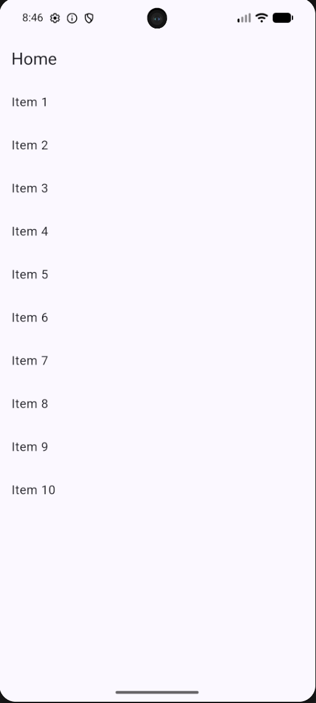
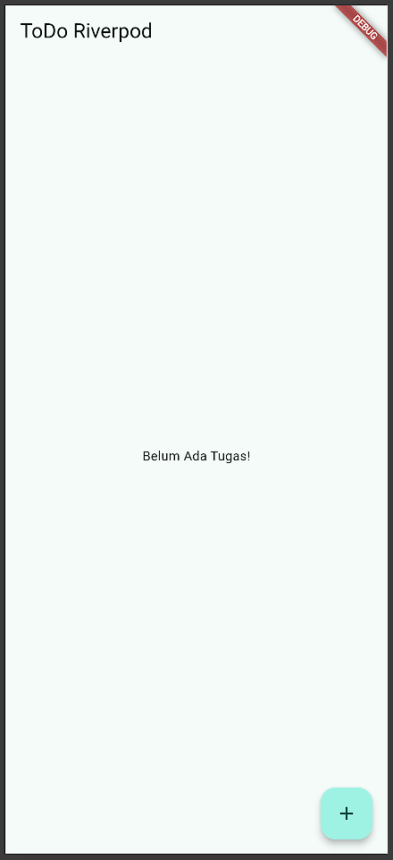
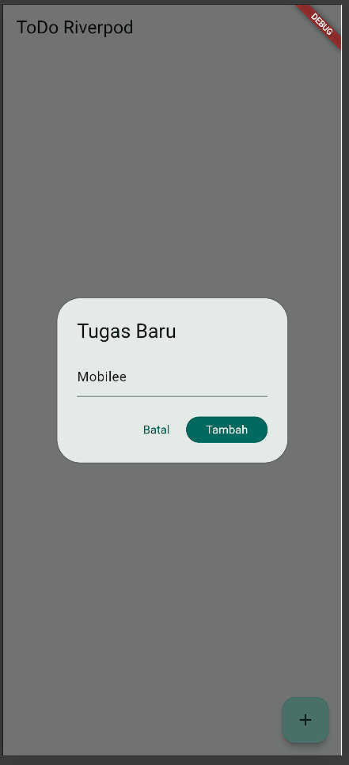
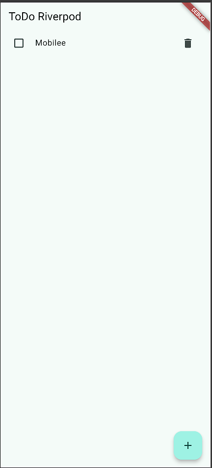
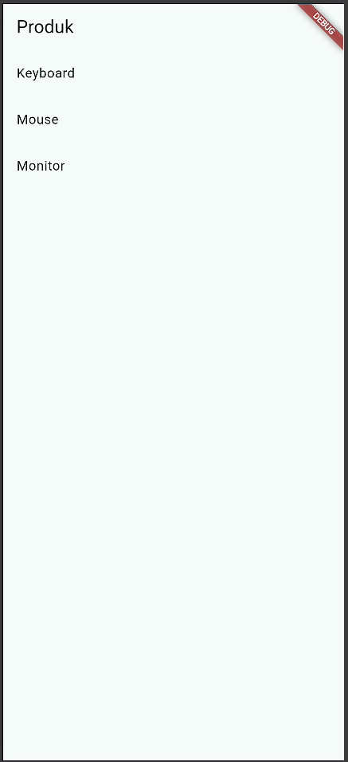

# 03-week-3-navigation-state-management

## Tujuan 

1. Menjelaskan konsep navigasi, route, dan perbedaan Navigator 1.0 dengan GoRouter;
2. Menerapkan navigasi multi-page dengan GoRouter, termasuk passing argument dan deep link sederhana;
3. Menjelaskan mengapa state management diperlukan dan cara kerja Riverpod (Provider, ConsumerWidget, Notifier);
4. Menggunakan AsyncValue untuk menangani state loading, error, dan success pada UI;
5. Membangun aplikasi ToDo dengan navigasi dan Riverpod, lalu memverifikasi hasilnya dengan widget test sederhana.

## Praktikum 1 - Aplikasi multi-page dengan GoRouter

Menjalankan dan mengamati terhadap pages yang telah dibuat pada class MyApp, HomePage, dan DetailPage.

Berikut merupakan tampilan aplikasi.

Berikut merupakan tampilan ketika menekan salah satu item.

Terlihat dari kedua hasil screenshot tersebut bahwa path yang ada mengikuti id dari setiap item, dan dapat diakses tanpa melalui page home.

## Praktikum 2 - Aplikasi ToDo dengan Riverpod 

Menjalankan dan memerhatikan pola mengenai ref.watch di dalam build dan ref.red di dalam callback.

Berikut merupakan tampilan awal untuk aplikasi ToDo.

Berikut adalah tampilan widget untuk menambahkan tugas.

Berikut adalah tampilan sesudah menambahkan tugas baru.

Pada praktikum ini, terlihat pola bahwa ref.watch bertugas untuk mengawasi bagian halaman ketika terdapat data yang masuk, maka ia akan secara otomatis menampilkan data tersebut. Sedangkan untuk ref.read(todoListProvider.notifier), ia digunakan untuk memanggil fungsi add, toggle, dan remove tanpa perlu mengawasi halaman.

## Praktikum 3 - Uji ketiga state

1. Salin kode di atas ke project ToDo Anda (atau project terpisah) dan jalankan. Amati tampilan loading selama 2 detik pertama.

    Berikut merupakan tampilan awal untuk tampilan loading selama 2 detik pertama dan setelah 2 detik.

    

    Setelah 2 detik pertama.

    

2. Ubah build() sementara untuk melempar error: throw Exception('Gagal terhubung ke server');. Jalankan dan amati UI error beserta tombol Coba lagi.

    Setelah menambahkan throw Exception di build() pada class ProductNotifier, maka sistem akan memuat data yang sangat lama sehingga menampilkan error seperti berikut beserta dengan tombol coba lagi.

    

    Ketika tombol Coba Lagi ditekan, sistem akan mencoba memanggil method build() kembali, namun akan gagal kembali karena masih terdapat kode program throw Exception tersebut.

3. Tekan tombol Coba lagi, ref.invalidate membuat provider dijalankan ulang. Pulihkan kode, pastikan state success tampil.

    Setelah memulihkan kode program dengan menghapus kode throw Exceptionnya, maka aplikasi akan memanggil metode build() kembali dan menampilkan list sesuai dengan state success.

    

4. Refleksikan: mengapa menampilkan ulang data lama (stale data) dengan indikator refresh kadang lebih baik daripada mengosongkan layar? Kapan pola itu penting?

    Menampilkan ulang data lama dengan indikator refresh lebih baik daripada mengosongkan layar, hal ini dikarenakan pengguna akan pasti paham ketika menekan tombol Coba Lagi dan muncul indikator refresh yang menandakan sistem sedang mencoba untuk mengambil suatu data. Tanpa adanya indikator tersebut, terdapat kemungkinan bahwa pengguna tidak dapat memahami apa yang sebenarnya terjadi pada aplikasinya. Pola ini penting ketika terdapat suatu event di aplikasi yang krusial, misal ketika pembayaran, feed sosial media, maupun aplikasi yang memerlukan internet sehingga menandakan jaringan dari perangkat yang terganggu. Sehingga pengguna dapat memahami konteks dari aplikasi tersebut.