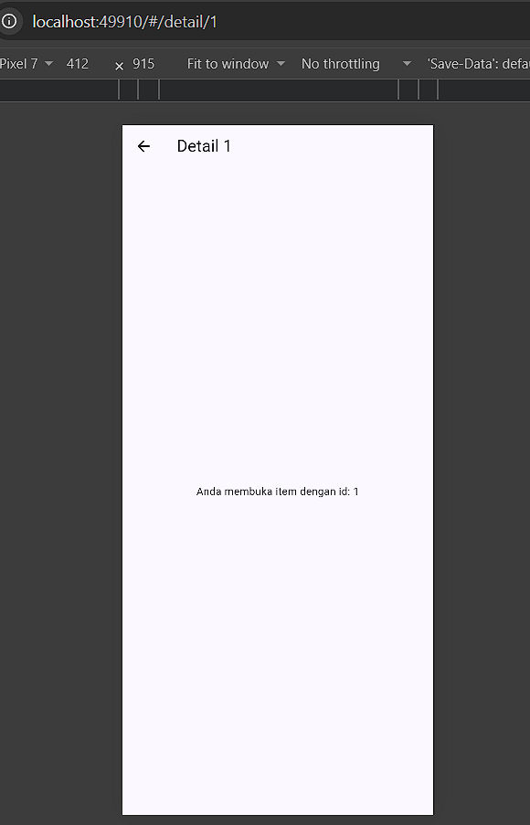

# 03-week-3-navigation-state-management

## Tujuan 

1. Menjelaskan konsep navigasi, route, dan perbedaan Navigator 1.0 dengan GoRouter;
2. Menerapkan navigasi multi-page dengan GoRouter, termasuk passing argument dan deep link sederhana;
3. Menjelaskan mengapa state management diperlukan dan cara kerja Riverpod (Provider, ConsumerWidget, Notifier);
4. Menggunakan AsyncValue untuk menangani state loading, error, dan success pada UI;
5. Membangun aplikasi ToDo dengan navigasi dan Riverpod, lalu memverifikasi hasilnya dengan widget test sederhana.

## Praktikum 1 - Aplikasi multi-page dengan GoRouter

Menjalankan dan mengamati terhadap pages yang telah dibuat pada class MyApp, HomePage, dan DetailPage.

Berikut merupakan tampilan aplikasi.

Berikut merupakan tampilan ketika menekan salah satu item.

Terlihat dari kedua hasil screenshot tersebut bahwa path yang ada mengikuti id dari setiap item, dan dapat diakses tanpa melalui page home.

## Praktikum 2 - Aplikasi ToDo dengan Riverpod 

Menjalankan dan memerhatikan pola mengenai ref.watch di dalam build dan ref.red di dalam callback.

Berikut merupakan tampilan awal untuk aplikasi ToDo.

Berikut adalah tampilan widget untuk menambahkan tugas.

Berikut adalah tampilan sesudah menambahkan tugas baru.

Pada praktikum ini, terlihat pola bahwa ref.watch bertugas untuk mengawasi bagian halaman ketika terdapat data yang masuk, maka ia akan secara otomatis menampilkan data tersebut. Sedangkan untuk ref.read(todoListProvider.notifier), ia digunakan untuk memanggil fungsi add, toggle, dan remove tanpa perlu mengawasi halaman.