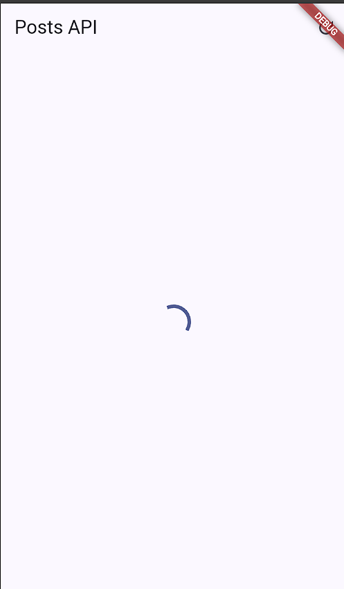
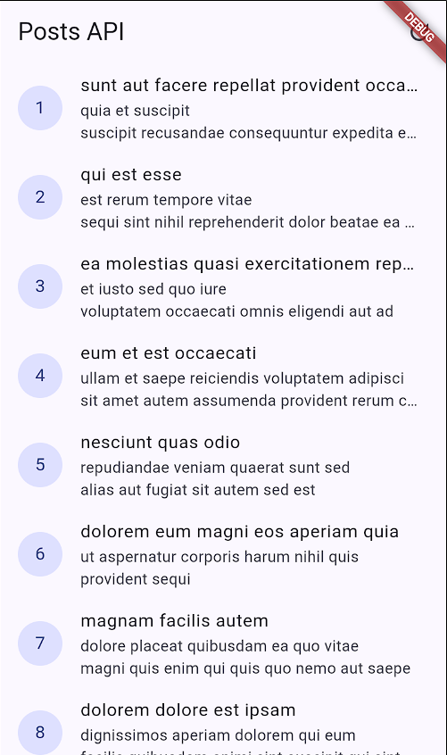
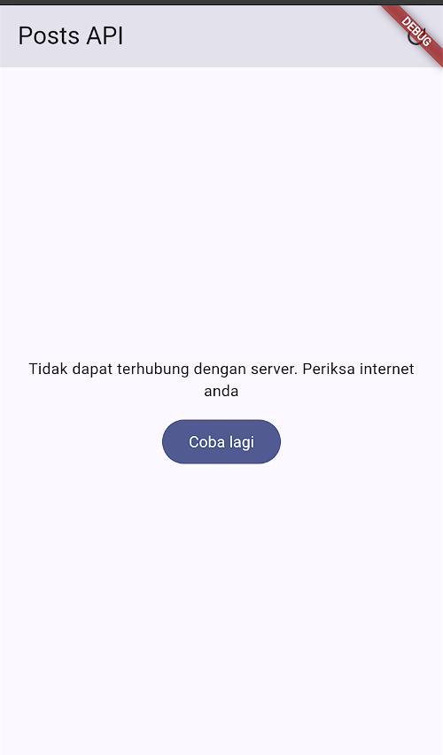
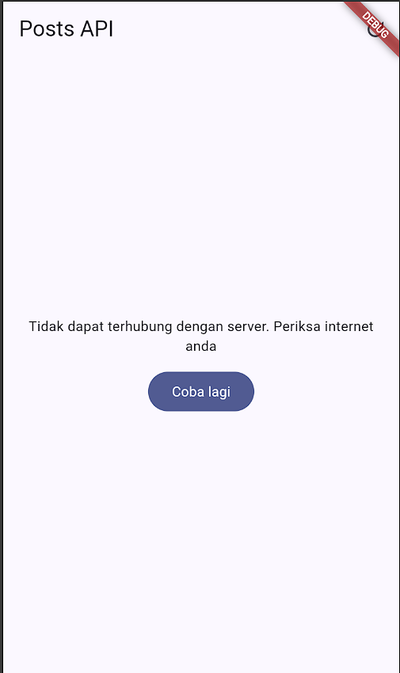
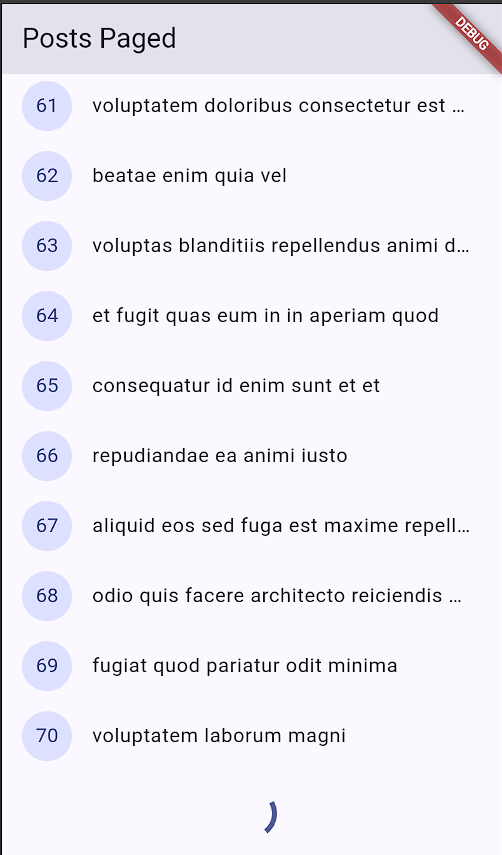
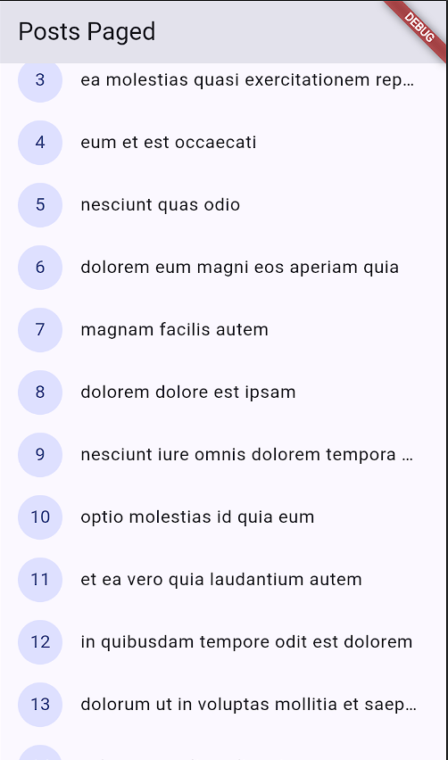
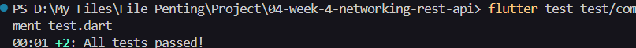
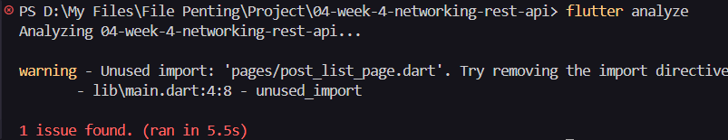
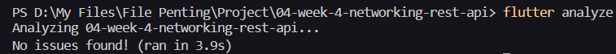

# 04-week-4-networking-rest-api

## Tujuan 

1. Menjelaskan konsep HTTP, REST API, dan JSON;
2. Memetakan JSON ke model Dart (serialization) dengan aman null;
3. Menerapkan repository pattern dasar sehingga UI tidak memanggil API secara langsung;
4. Mengonfigurasi Dio (base URL, timeout, interceptor) dan menangani error jaringan;

## Praktikum 1: Dio dan model data

Membuat data dengan fromJson aman null

Mengonfigurasi Dio terpusat

Membuat repository sebagai pintu data

## Praktikum 2: Provider dan error handling

Membuat Provider AsyncNotifier dan pesan error ramha pengguna

Membuat UI loading, error, empty, success

Mengentry point dnegan ProviderScope

Uji tigas skenario

1. Jalankan aplikasi dengan internet normal, amati loading lalu daftar 100 posts.

    Ketika aplikasi dijalankan dengan koneksi internet normal, sistem akan menampilkan indikator loading selama proses pengambilan data dari API. Setelah data berhasil diterima, aplikasi akan menampilkan daftar post yang diperoleh melalui endpoint.

    

    

2. Matikan internet (mode pesawat), tekan refresh, amati pesan ramah + tombol Coba lagi. Nyalakan kembali internet, tekan Coba lagi.

    Ketika koneksi internet dimatikan dan tombol refresh ditekan, aplikasi akan mencoba mengambil ulang data dari server. Karena tidak terdapat koneksi internet, proses tersebut gagal dan aplikasi menampilkan pesan yang lebih mudah dipahami oleh pengguna, yaitu "Tidak dapat terhubung dengan server. Periksa internet anda", serta menyediakan tombol Coba lagi.

    Setelah koneksi internet dinyalakan kembali dan tombol Coba lagi ditekan, ref.invalidate(postListProvider) akan menjalankan ulang provider sehingga aplikasi mencoba mengambil data kembali. Apabila koneksi telah kembali normal, daftar post akan berhasil ditampilkan kembali.

    

3. Sementara ubah baseUrl menjadi URL salah, amati pesan error koneksi. Kembalikan setelah uji.

    ada pengujian ini, baseUrl yang sebelumnya mengarah ke server JSONPlaceholder diubah sementara menjadi URL yang salah. Hal tersebut menyebabkan aplikasi tidak dapat terhubung ke server sehingga DioException ditangani oleh fungsi friendlyErrorMessage() dan aplikasi menampilkan pesan error koneksi yang lebih mudah dipahami pengguna.

    Setelah pengujian selesai, baseUrl dikembalikan ke URL yang benar agar aplikasi dapat kembali terhubung ke API dan mengambil data post seperti semula.

     

## Praktikum 3: Pagination dasar

Membuat repositori paginated

Membuat notifier dengan state halaman

Membuat UI infinite Scroll

Berikut merupakan tampilan ketika diterapkan pagination.

Terlihat pada aplikasi yakni pagination telah diterapkan dengan bukti bahwa ketika sebelum discroll hingga batas bawah, maka aplikasi tidka memunculkan 10 item berikutnya, dan hanya menampilkan indikator loading. Setelah discroll hingga batas bawah, maka aplikasi memunculkan 10 item berikutnya.

## AI Challenge

1. Agent yang dipakai: Copilot

2. Prompt yang digunakan:

    Buatkan repository layer Flutter untuk endpoint GET /comments?postId={id}
    dari JSONPlaceholder menggunakan Dio + flutter_riverpod.
    Requirements:
    - Model Comment dengan fromJson aman null (postId, id, name, email, body).
    - CommentRepository dengan method fetchComments(postId) + timeout 10 detik.
    - AsyncNotifierProvider dengan penanganan error otomatis (AsyncError)
    dan fungsi pesan error
    ramah pengguna untuk timeout, connection error, 404, dan 500.
    - Satu unit test untuk fromJson dengan field yang hilang.
    Jelaskan setiap bagian kode dalam komentar.

3. Output awal AI:

    - providers.dart

        import 'package:dio/dio.dart';
        import 'package:flutter_riverpod/flutter_riverpod.dart';
        import 'dart:async';
        import 'api_client.dart';
        import 'models/comment.dart';
        import 'models/post.dart';
        import 'repositories/comment_repository.dart';
        import 'repositories/post_repository.dart';

        final dioProvider = Provider<Dio>((ref) => createDio());

        final postRepositoryProvider = Provider<PostRepository>(
        (ref) => PostRepository(ref.watch(dioProvider))
        );

        // Repository di-inject melalui provider agar mudah diganti dengan mock saat test.
        final commentRepositoryProvider = Provider<CommentRepository>(
        (ref) => CommentRepository(ref.watch(dioProvider)),
        );

        // Notifier menerima postId dari family sehingga tiap postId punya state sendiri.
        class CommentsNotifier extends AsyncNotifier<List<Comment>> {
        CommentsNotifier(this.postId);

        final int postId;

        // Exception dibiarkan naik agar Riverpod membentuk AsyncError otomatis.
        @override
        Future<List<Comment>> build() {
            return ref.watch(commentRepositoryProvider).fetchComments(postId);
        }

        // Memuat ulang komentar dan mempertahankan penanganan state async Riverpod.
        Future<void> refresh() async {
            state = const AsyncLoading();
            state = await AsyncValue.guard(
            () => ref.read(commentRepositoryProvider).fetchComments(postId),
            );
        }
        }

        // Family membuat instance dan state notifier terpisah untuk setiap postId.
        final commentsProvider = AsyncNotifierProvider.family<
        CommentsNotifier,
        List<Comment>,
        int
        >(CommentsNotifier.new);

        class PostListNotifier extends AsyncNotifier<List<Post>> {

        @override
        Future<List<Post>> build() async {
            final repository = ref.watch(postRepositoryProvider);
            return repository.fetchPosts();
        }

        Future<void> refresh() async {
            state = AsyncLoading();
            try {
            final repository = ref.read(postRepositoryProvider);
            state = AsyncData(await repository.fetchPosts());
            } catch(e, st) {
            state = AsyncError(e, st);
            }
        }
        }

        final postListProvider =
        AsyncNotifierProvider<PostListNotifier, List<Post>>(
            PostListNotifier.new,
            retry: (retryCount, error) => null
        );

        Future<List<Post>> readPostOnce(ProviderContainer container) {
        final completer = Completer<List<Post>>();
        final sub = container.listen<AsyncValue<List<Post>>>(
            postListProvider,
            (previous, next) {
            if (next.isLoading || completer.isCompleted) return;
            next.whenData(completer.complete);
            if (next.hasError) {
                completer.completeError(
                next.error ?? StateError('unknown error'),
                next.stackTrace ?? StackTrace.empty,
                );
            }
            },
            fireImmediately: true,
        );
        return completer.future.whenComplete(sub.close);
        }

        Future<Object?> readPostsErrorOnce(ProviderContainer container) {
        final completer = Completer<Object?>();
        final sub = container.listen<AsyncValue<List<Post>>>(
            postListProvider,
            (previous, next) {
            if (next.isLoading || completer.isCompleted) return;
            completer.complete(next.error);
            },
            fireImmediately: true,
        );
        return completer.future.whenComplete(sub.close);
        }

        String friendlyErrorMessage(Object error) {
        if(error is DioException) {
            switch(error.type) {
            case DioExceptionType.connectionTimeout:
            case DioExceptionType.sendTimeout:
            case DioExceptionType.receiveTimeout:
                return 'Koneksi lambat. Periksa internet anda';
            case DioExceptionType.connectionError:
                return 'Tidak dapat terhubung dengan server. Periksa internet anda';
            case DioExceptionType.badResponse:
                final code = error.response?.statusCode;
                if (code == 404) return 'Data tidak ditemukan (404)';
                if (code == 401 || code == 403) {
                return 'Akses ditolak ($code). Perika kredensial anda.';
                }
                return 'Server bermasalah ($code). Coba lagi nanti';
            default:
                return 'Terjadi kesalahan jaringan. Coba lagi';
            }
        }
        return 'Terjadi kesalahan tak terduga';
        }

        /// Mengubah error jaringan menjadi pesan yang dapat dipahami pengguna.
        String commentErrorMessage(Object error) {
        if (error is DioException) {
            switch (error.type) {
            case DioExceptionType.connectionTimeout:
            case DioExceptionType.sendTimeout:
            case DioExceptionType.receiveTimeout:
                return 'Permintaan terlalu lama. Periksa koneksi internet lalu coba lagi.';
            case DioExceptionType.connectionError:
                return 'Tidak dapat terhubung ke server. Periksa koneksi internet Anda.';
            case DioExceptionType.badResponse:
                switch (error.response?.statusCode) {
                case 404:
                    return 'Komentar tidak ditemukan.';
                case 500:
                    return 'Server sedang bermasalah. Coba lagi nanti.';
                default:
                    return 'Server mengembalikan error. Coba lagi nanti.';
                }
            default:
                return 'Terjadi kesalahan jaringan. Coba lagi.';
            }
        }
        return 'Terjadi kesalahan tak terduga. Coba lagi.';
        }

    - comment.dart

        /// Merepresentasikan satu komentar dari endpoint JSONPlaceholder.
        class Comment {
        const Comment({
            required this.postId,
            required this.id,
            required this.name,
            required this.email,
            required this.body,
        });

        final int postId;
        final int id;
        final String name;
        final String email;
        final String body;

        /// Membaca JSON dengan fallback aman agar field null atau hilang
        /// tidak menyebabkan cast error saat response tidak lengkap.
        factory Comment.fromJson(Map<String, dynamic> json) {
            return Comment(
            postId: (json['postId'] as num?)?.toInt() ?? 0,
            id: (json['id'] as num?)?.toInt() ?? 0,
            name: json['name'] as String? ?? '',
            email: json['email'] as String? ?? '',
            body: json['body'] as String? ?? '',
            );
        }
        }

    - comment_repository.dart

        import 'package:dio/dio.dart';

        import '../models/comment.dart';

        /// Menyediakan akses khusus untuk endpoint komentar.
        class CommentRepository {
        CommentRepository(this._dio);

        final Dio _dio;

        /// Mengambil komentar untuk post tertentu dengan batas waktu 10 detik.
        Future<List<Comment>> fetchComments(int postId) async {
            final response = await _dio.get<List<dynamic>>(
            '/comments',
            queryParameters: {'postId': postId},
            options: Options(
                connectTimeout: const Duration(seconds: 10),
                sendTimeout: const Duration(seconds: 10),
                receiveTimeout: const Duration(seconds: 10),
            ),
            );

            // Hanya item berbentuk object yang dipetakan agar response yang tidak
            // sesuai kontrak tidak membuat seluruh parsing gagal.
            return (response.data ?? [])
                .whereType<Map<String, dynamic>>()
                .map(Comment.fromJson)
                .toList();
        }
        }

    - comment_test.dart

        import 'package:flutter_test/flutter_test.dart';
        import 'package:week4_api/data/models/comment.dart';

        void main() {
        test('Comment.fromJson memakai nilai default saat field hilang', () {
            // Map kosong mensimulasikan response JSON yang tidak lengkap.
            final comment = Comment.fromJson({});

            // Semua field tetap valid dan tidak menghasilkan exception cast/null.
            expect(comment.postId, 0);
            expect(comment.id, 0);
            expect(comment.name, '');
            expect(comment.email, '');
            expect(comment.body, '');
        });
        }

Berikut merupakan tampilan aplikasi setelah dieksekusi oleh Copilot.

4. AI Verification Checklist

    a. Apakah UI memanggil Dio secara langsung (dilarang) atau lewat repository?

        UI tidak memanggil Dio secara langsung. Proses pengambilan data dilakukan melalui repository yang kemudian diakses menggunakan provider. Pada CommentsNotifier, data komentar diperoleh melalui commentRepositoryProvider, sedangkan data post diperoleh melalui postRepositoryProvider. Dengan demikian, pemisahan antara UI, state management, dan proses akses API sudah diterapkan dengan baik.

    b. Apakah fromJson aman null, atau masih memakai cast langsung yang bisa crash?

        Method Comment.fromJson() sudah cukup aman terhadap nilai null atau field yang hilang karena menggunakan nullable cast dan memberikan nilai default menggunakan operator ??. Field angka akan menggunakan nilai 0, sedangkan field String akan menggunakan string kosong apabila data tidak tersedia.

    c. Apakah semua tipe DioExceptionType (timeout, connectionError, badResponse) dipetakan ke pesan pengguna?
    
        Ya. Fungsi commentErrorMessage() telah menangani connectionTimeout, sendTimeout, dan receiveTimeout sebagai kondisi timeout. Selain itu, connectionError juga memiliki pesan tersendiri dan badResponse ditangani berdasarkan status HTTP, termasuk 404 dan 500. Error jaringan lainnya ditangani melalui bagian default. Dengan demikian, tipe error utama yang diminta sudah diterjemahkan menjadi pesan yang lebih mudah dipahami pengguna.
    
    d. Apakah baseUrl/timeout terpusat di satu client, bukan tersebar di tiap method?
    
        Belum sepenuhnya. baseUrl, connectTimeout, dan receiveTimeout sebenarnya sudah didefinisikan pada BaseOptions di api_client.dart, sehingga konfigurasi dasar Dio sudah dipusatkan.

        Namun, pada CommentRepository.fetchComments(), AI kembali mendefinisikan connectTimeout, sendTimeout, dan receiveTimeout masing-masing sebesar 10 detik melalui Options. Artinya konfigurasi timeout masih tersebar dan terjadi duplikasi konfigurasi.

        Berikut merupakan perbaikan kode programnya.

        - api_client.dart

            import 'package:dio/dio.dart';

            Dio createDio() {
            final dio = Dio(
                BaseOptions(
                baseUrl: 'https://jsonplaceholder.typicode.com',
                connectTimeout: const Duration(seconds: 10),
                sendTimeout: const Duration(seconds: 10),
                receiveTimeout: const Duration(seconds: 10),
                headers: {'Accept': 'application/json'}
                ),
            );

            dio.interceptors .add(
                LogInterceptor(requestBody: true, responseBody: false),
            );

            return dio;
            }

        - comment_repository.dart

            import 'package:dio/dio.dart';

            import '../models/comment.dart';

            /// Menyediakan akses khusus untuk endpoint komentar.
            class CommentRepository {
            CommentRepository(this._dio);

            final Dio _dio;

            /// Mengambil komentar untuk post tertentu dengan batas waktu 10 detik.
            Future<List<Comment>> fetchComments(int postId) async {
                final response = await _dio.get<List<dynamic>>(
                '/comments',
                queryParameters: {'postId': postId},
                );

                // Hanya item berbentuk object yang dipetakan agar response yang tidak
                // sesuai kontrak tidak membuat seluruh parsing gagal.
                return (response.data ?? [])
                    .whereType<Map<String, dynamic>>()
                    .map(Comment.fromJson)
                    .toList();
            }
            }
    
    e. Apakah test AI benar-benar menguji kasus field hilang, atau hanya happy path? Tambahkan minimal 1 edge case sendiri.
    
        Test yang dibuat AI benar-benar menguji field yang hilang, bukan hanya happy path. Hal tersebut dilakukan dengan memberikan map kosong {} kepada Comment.fromJson() dan kemudian memastikan seluruh field memperoleh nilai default.

        Berikut merupakan penambahan kode programnya.

        import 'package:flutter_test/flutter_test.dart';
        import 'package:week4_api/data/models/comment.dart';

        void main() {
        test('Comment.fromJson memakai nilai default saat field hilang', () {
            final comment = Comment.fromJson({});

            expect(comment.postId, 0);
            expect(comment.id, 0);
            expect(comment.name, '');
            expect(comment.email, '');
            expect(comment.body, '');
        });

        test('Comment.fromJson aman ketika beberapa field bernilai null', () {
            final comment = Comment.fromJson({
            'postId': null,
            'id': null,
            'name': null,
            'email': null,
            'body': null,
            });

            expect(comment.postId, 0);
            expect(comment.id, 0);
            expect(comment.name, '');
            expect(comment.email, '');
            expect(comment.body, '');
        });
        }
    
    f. Jalankan flutter analyze dan flutter test, apakah hasil AI lolos tanpa warning?

        Berikut merupakan hasil flutter analyze dan flutter test setelah dieksekusi oleh Copilot:

    

        Terlihat pada hasil screenshot tersebut bahwa output AI untuk perintah flutter test lolos tanpa warning.

        Sedangkan dari pemeriksaan kode secara statis, terdapat setidaknya satu hal yang berpotensi menghasilkan warning pada main.dart, yaitu import post_list_page.dart yang tidak digunakan karena halaman utama saat ini menggunakan PagedPostPage.
        Dengan demikian, output AI belum dapat dikatakan lolos tanpa warning untuk perintah flutter analyze.
        
    
        
        Import yang tidak digunakan tersebut sebaiknya dihapus terlebih dahulu

        import 'package:flutter/material.dart';
        import 'package:flutter_riverpod/flutter_riverpod.dart';
        import 'package:week4_api/pages/paged_post_page.dart';

    

    