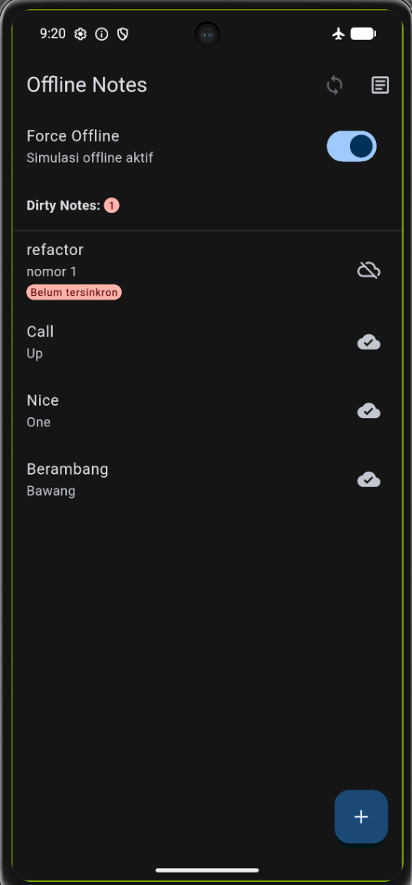
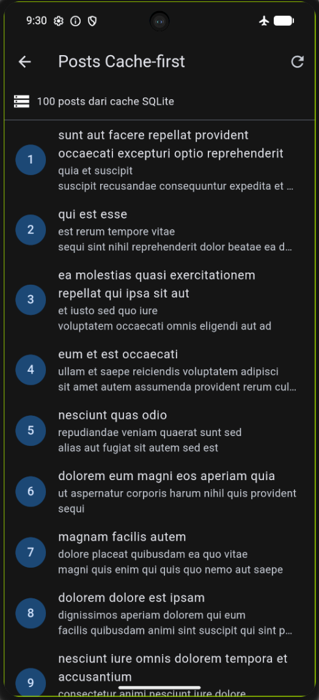
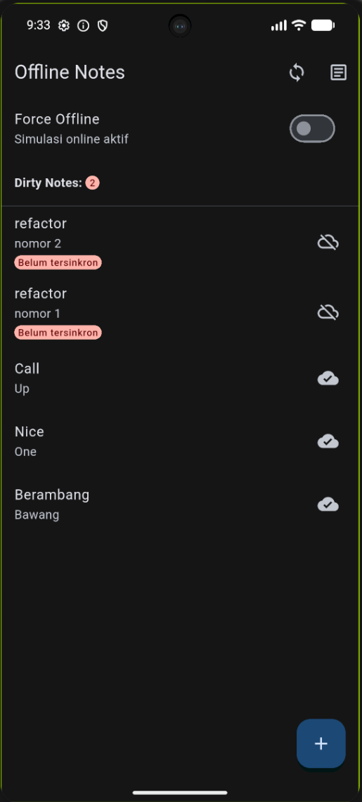
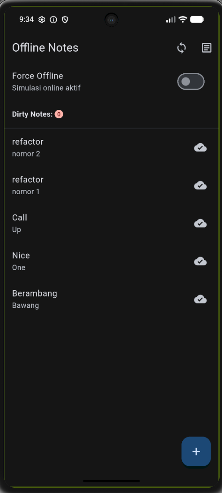
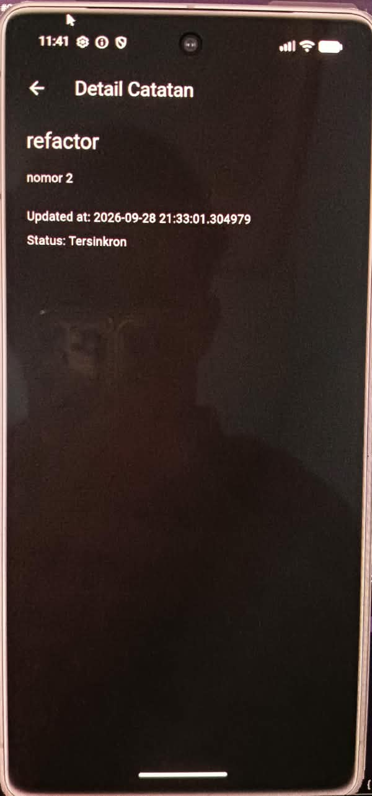
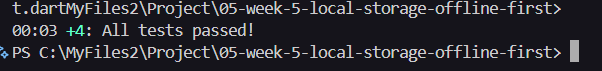
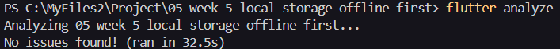

# 05-week-5-local-storage-offline-first

## Tujuan 

1. Menjelaskan perbedaan penyimpanan key-value, relasional, dan NoSQL di perangkat.
2. Menyimpan preferensi sederhana (tema, terakhir dibuka) dengan SharedPreferences.
3. Menerapkan CRUD catatan dengan SQLite (sqflite) melalui repository lokal.
4. Menerapkan pola offline-first: cache-first read, dirty flag, dan antrean sinkronisasi.
5. Menampilkan state loading, error, empty, dan success untuk data lokal dengan Riverpod.
6. Menguji repository lokal dengan repository palsu (tanpa database sungguhan).

## Praktikum 1: SharedPreferences

Membuat repository preferensi untuk menyimpan akses key-value terpusat.

Membuat provider dan halaman pengaturan.

Berikut merupakan contoh bukti tmapilan aplikasi untuk page setting untuk tema terang.


Dan berikut merupakan untuk tampilan gelapnya.


Setelah dilakukan hot restart, maka tampilan aplikasi akan tetap pada mode dark karena digunakan shared preferences.


## Praktikum 2: SQLite dan repository catatan

Membuat model catatan.

Membuat pembuka database pada db.dart.

Membuat repository sebagai satu-satunya pintu akses data yang terdapat
pada note_repository.dart.

Membuat halaman catatan offline yang mengambil data melalui
notesProvider dan NoteRepository.

Berikut merupakan tampilan catatan yang telah tersimpan pada SQLite.


Catatan yang sebelumnya ditambahkan tetap tersimpan dan dapat
ditampilkan kembali karena data disimpan pada SQLite melalui
NoteRepository.

## Praktikum 3: Cache-first dan antrean sync

Menggunakan endpoint minggu 4 GET /posts untuk JSON placeholder

Berikut merupakan tampilan catatan setelah diambil data melalui API GET /posts pertama kali, namun tidak terhubung dengan internet.


Berikut merupakan tampilannya ketika ditekan refresh dan terhubung dengan internet.


List tersebut tetap tersimpan di SQLite meskipun tidak terhubung dengan internet, dan ketika dilakukan hot restart pada aplikasi nya.


Menyinkronisasikan catatan kotor (dirty) 

Berikut merupakan tampilan badge dirty notes beserta jumlah yang masih dirty.


Berikut merupakan tampilannya setelah dilakukan sync.


Simulasi offline determinisik

Berikut merupakan tampilan ketika force offline dimatikan.


Berikut merupakan tampilan ketika force offline dinyalakan.


Berikut tampilan ketika dilakukan penambahan notes sebelum sync (Force offline mati).


Dan berikut merupaakn tampilan ketika force Offline dimatikan dan dilakukan sync.


Saat Force Offline diaktifkan, catatan yang telah tersimpan tetap dapat ditampilkan dan catatan baru dapat disimpan ke SQLite dengan status dirty. Setelah koneksi disimulasikan kembali online dan proses sinkronisasi dijalankan, nilai dirty berubah dari 2 menjadi 0.

## AI Challenge

1. Agent yang dipakai: Copilot

2. Prompt yang digunakan:

    Aplikasi Flutter Offline Notes: CRUD catatan + preferensi tema.
    Bandingkan SharedPreferences, Hive, sqflite (SQLite), dan Drift
    untuk dua kebutuhan ini. Requirements:
    - Kriteria: kompleksitas query, kebutuhan relasi, reaktivitas (stream),
    type-safety, ukuran boilerplate, dan kemudahan testing.
    - Beri rekomendasi final: mana untuk preferensi, mana untuk catatan,
    beserta alasannya dalam 1 tabel.
    - Tunjukkan skema tabel/kotak untuk 1000+ catatan.
    Jelaskan trade-off setiap pilihan.

3. Output awal AI:

        ## Perbandingan penyimpanan dan rekomendasi

        Ada dua jenis data pada aplikasi ini: preferensi tema yang berupa beberapa nilai sederhana, dan catatan yang membutuhkan CRUD, pengurutan, filter, status sinkronisasi, serta kemungkinan pertumbuhan menjadi 1000+ baris.

        | Pilihan | Preferensi tema | Catatan 1000+ | Kompleksitas query dan relasi | Reaktivitas (stream) | Type-safety | Boilerplate | Testing dan trade-off |
        | --- | --- | --- | --- | --- | --- | --- | --- |
        | **SharedPreferences** | **Sangat cocok** untuk boolean/string kecil | Tidak direkomendasikan | Key-value; tidak ada query, indeks, atau relasi | Tidak native; perlu memuat ulang atau membungkus perubahan sendiri | Rendah; tipe dibatasi `bool`, `int`, `double`, `String`, dan list string | **Paling kecil** | Mudah di-mock, tetapi rawan typo key dan tidak punya transaksi. Pilihan final untuk preferensi. |
        | **Hive** | Cocok, tetapi berlebihan untuk dua nilai | Cocok untuk objek sederhana dan akses key/value cepat | Query koleksi lebih terbatas; relasi dan query SQL kompleks harus dirancang sendiri | Baik melalui `watch()`/box listener | Sedang; adapter dan field perlu dikelola | Kecil sampai sedang | Cepat dan mudah dites dengan box memory, tetapi migrasi, relasi, dan query laporan lebih manual. |
        | **sqflite (SQLite)** | Bisa, tetapi terlalu berat untuk key-value | **Sangat cocok** untuk CRUD, filter, sort, transaksi, dan indeks | SQL lengkap; relasi perlu dibuat dengan SQL dan foreign key | Tidak built-in; repository perlu memicu refresh atau memakai stream sendiri | Sedang-rendah; map dan SQL berupa string sehingga error banyak muncul saat runtime | Sedang | Mudah dites dengan database in-memory atau fake repository. Trade-off-nya adalah mapping manual dan tidak ada compile-time check untuk query. Pilihan final untuk catatan pada aplikasi ini. |
        | **Drift** | Bisa, tetapi overkill untuk preferensi sederhana | **Sangat cocok** bila query, relasi, dan stream bertambah | SQL dengan abstraksi tabel, join, migrasi, dan indeks | **Sangat baik**; query dapat menghasilkan stream reaktif | **Tinggi**; tabel dan query diverifikasi generator/compiler | Paling besar; membutuhkan generator dan setup build | Sangat kuat untuk aplikasi data-heavy dan mudah dites dengan executor khusus, tetapi menambah dependency, generated code, dan waktu setup. Pilihan upgrade jika domain catatan makin kompleks. |

        ### Rekomendasi final

        | Kebutuhan | Pilihan | Alasan keputusan |
        | --- | --- | --- |
        | Preferensi tema dan `last_opened_at` | **SharedPreferences** | Hanya beberapa nilai key-value, tidak memerlukan query, relasi, stream, atau transaksi. API kecil dan pengujiannya sederhana. |
        | CRUD catatan offline, dirty flag, cache, dan sinkronisasi | **sqflite (SQLite)** | Sudah mendukung query terurut, filter dirty, transaksi, indeks, dan skala 1000+ catatan dengan boilerplate yang masih proporsional. Jika UI nantinya wajib menerima perubahan database sebagai stream dan query/relasi meningkat, migrasikan repository ke **Drift**. |

        ### Skema tabel untuk 1000+ catatan

        SQLite menyimpan catatan sebagai baris, bukan satu JSON besar. Dengan begitu hanya halaman yang diperlukan yang dibaca dan perubahan satu catatan tidak menulis ulang seluruh koleksi.

        ```text
        +------------------+       1       0..N       +----------------------+
        | notes            |-------------------------->| note_tags            |
        +------------------+                           +----------------------+
        | id PK INTEGER    |                           | note_id PK/FK       |
        | title TEXT       |                           | tag_id  PK/FK       |
        | body TEXT        |                           +----------------------+
        | updated_at TEXT  |
        | dirty INTEGER    |       N       0..N       +----------------------+
        +------------------+-------------------------->| tags                 |
                                                                                                        +----------------------+
                                                                                                        | id PK INTEGER        |
                                                                                                        | name TEXT UNIQUE     |
                                                                                                        +----------------------+
        ```

        Untuk versi aplikasi saat ini, tabel minimalnya cukup `notes`; `tags` dan `note_tags` adalah perluasan bila relasi tag dibutuhkan.

        ```sql
        CREATE TABLE notes (
            id INTEGER PRIMARY KEY AUTOINCREMENT,
            title TEXT NOT NULL,
            body TEXT NOT NULL DEFAULT '',
            updated_at TEXT NOT NULL,
            dirty INTEGER NOT NULL DEFAULT 0
        );

        CREATE INDEX idx_notes_updated_at ON notes(updated_at DESC);
        CREATE INDEX idx_notes_dirty ON notes(dirty);
        ```

        Ambil data 50 baris per halaman agar daftar besar tidak dimuat sekaligus:

        ```sql
        SELECT id, title, body, updated_at, dirty
        FROM notes
        ORDER BY updated_at DESC, id DESC
        LIMIT 50 OFFSET 0;
        ```

        Untuk halaman yang sangat besar, keyset pagination lebih stabil daripada `OFFSET`: gunakan `WHERE (updated_at, id) < (?, ?)` dengan cursor dari baris terakhir. `dirty` tetap dipertahankan agar antrean sinkronisasi dapat mencari `WHERE dirty = 1` tanpa mengganggu catatan lain.

4. AI Verification Checklist

    a. Apakah AI menempatkan daftar catatan di SharedPreferences? (menolak: rapuh untuk koleksi).

        Tidak. AI menyatakan SharedPreferences tidak direkomendasikan untuk 1000+ catatan dan memilihnya hanya untuk preferensi.

    b. Apakah skema AI mendukung antrean sync (dirty flag / updated_at) atau hanya CRUD polos?

        Ya. Skema notes memiliki dirty dan updated_at. AI juga menyebut WHERE dirty = 1.

    c. Apakah klaim "real-time" AI didukung stream (Drift/watch) atau hanya asumsi?

        Ya, penjelasannya cukup tepat. AI menyatakan sqflite tidak memiliki stream built-in, sedangkan Drift mendukung query reaktif/stream.

    d. Apakah estimasi boilerplate AI masuk akal setelah Anda mencoba instalasinya (flutter pub add + migrasi skema)?

        Perlu diverifikasi berdasarkan praktik. SharedPreferences paling sederhana; sqflite membutuhkan database, model/mapping, dan repository. Drift disebut memiliki setup/generator lebih besar. Kamu tidak perlu menginstal Drift hanya jika jobsheet tidak secara eksplisit mewajibkan mencoba semua alternatif; tetapi checklist memang meminta mempertimbangkan pengalaman flutter pub add + migrasi skema.

    e. Keputusan final Anda beserta alasannya, boleh berbeda dari rekomendasi AI selama berargumen.

        SharedPreferences untuk preferensi dan sqflite untuk catatan. Ini sesuai implementasi project saat ini.

## Refactoring, Testing, dan error umum

1. Ekstrak baris catatan menjadi widget NoteTile tersendiri yang menampilkan badge "belum tersinkron" bila dirty == true.

    Berikut merupakan tampilan aplikasi ketika terdapat suatu note yang belum tersinkron.

    

2. Pindahkan logika cache posts dan syncNotes ke file lib/data/sync.dart agar repository tetap fokus pada CRUD.

    Berikut merupakan tampilan Posts ketika data berhasil ditampilkan dari cache SQLite.

    

    Berikut merupakan tampilan proses sinkronisasi note yang sebelumnya memiliki status belum tersinkron.

    

    Berikut merupakan tampilan aplikasi setelah proses sinkronisasi berhasil, ditandai dengan nilai Dirty Notes kembali menjadi 0.

    


3. Tambahkan halaman detail catatan dengan GoRouter (/note/:id) yang membaca dari repository lokal, bukan dari state halaman list.

    Beirkut merupakan tampilan detail untuk suatu notes dengan implementasi GoRouter.

    

Berikut merupakan hasil testing nya






## Mini Project

1. Preferensi: toggle tema gelap/terang + waktu terakhir dibuka via SharedPreferences.
2. CRUD catatan persisten via SQLite (sqflite) melalui repository lokal + Riverpod; daftar diurutkan updated_at terbaru.
3. Offline-first: cache-first untuk data bacaan, dirty flag + syncNotes untuk tulisan, dan aturan konflik eksplisit yang didokumentasikan.
4. Buktikan mode pesawat: screenshot daftar catatan saat offline dan badge dirty sebelum/sesudah sync.
5. Sertakan minimal 2 test yang lulus (1 unit test model + 1 test provider dengan repository palsu).
6. Kerjakan bagian AI Challenge dan dokumentasikan prompt, tabel perbandingan storage, keputusan final, serta alasan teknis Anda di docs/.
7. Push ke repository portfolio pada folder 05-week-5-local-storage-offline-first/ dengan struktur lib/, test/, docs/, README.md, dan screenshots/. README menjelaskan tujuan, fitur utama, stack teknologi, cara menjalankan, dan hasil yang dicapai.

## Refleksi

1. Mengapa daftar catatan tidak boleh disimpan di SharedPreferences? Apa yang rusak jika aturan ini dilanggar?

    Jawaban: Karena SharedPreferences cocok untuk data key-value sederhana, bukan koleksi catatan. Jika dipaksakan, proses pencarian, update, filter, dan sinkronisasi banyak catatan menjadi sulit dan rapuh.

2. Kapan cache-first cukup, dan kapan Anda membutuhkan strategi lain (misalnya network-first untuk data harga real-time)?

    Jawaban: Cache-first cocok saat aplikasi harus tetap menampilkan data ketika offline dan data tidak harus selalu terbaru. Untuk data yang sangat cepat berubah, seperti harga real-time, lebih cocok network-first agar data terbaru diprioritaskan.

3. Bagaimana dirty flag berubah menjadi antrean sync tanpa memblokir UI? Kapan antrean terpisah (tabel outbox) menjadi perlu?

    Jawaban: Data yang berubah diberi dirty = true, lalu proses sync mengambil data dirty di background tanpa memblokir UI. Tabel outbox diperlukan jika operasi sync semakin kompleks, misalnya banyak operasi create, update, dan delete yang harus disimpan serta dikirim secara berurutan

4. Bagian mana dari rekomendasi AI yang Anda tolak, dan mengapa?

    Jawaban: Saya menolak penambahan tabel tags dan note_tags karena aplikasi saat ini belum memiliki fitur tag. Untuk kebutuhan sekarang, tabel notes dengan updated_at dan dirty sudah cukup.