# 05-week-5-local-storage-offline-first

## Tujuan 

1. Menjelaskan perbedaan penyimpanan key-value, relasional, dan NoSQL di perangkat.
2. Menyimpan preferensi sederhana (tema, terakhir dibuka) dengan SharedPreferences.
3. Menerapkan CRUD catatan dengan SQLite (sqflite) melalui repository lokal.
4. Menerapkan pola offline-first: cache-first read, dirty flag, dan antrean sinkronisasi.
5. Menampilkan state loading, error, empty, dan success untuk data lokal dengan Riverpod.
6. Menguji repository lokal dengan repository palsu (tanpa database sungguhan).

## Praktikum 1: SharedPreferences

Membuat repository preferensi untuk menyimpan akses key-value terpusat.

Membuat provider dan halaman pengaturan.

Berikut merupakan contoh bukti tmapilan aplikasi untuk page setting untuk tema terang.

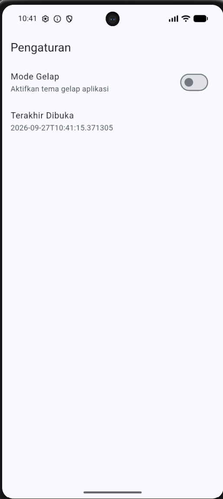

Dan berikut merupakan untuk tampilan gelapnya.

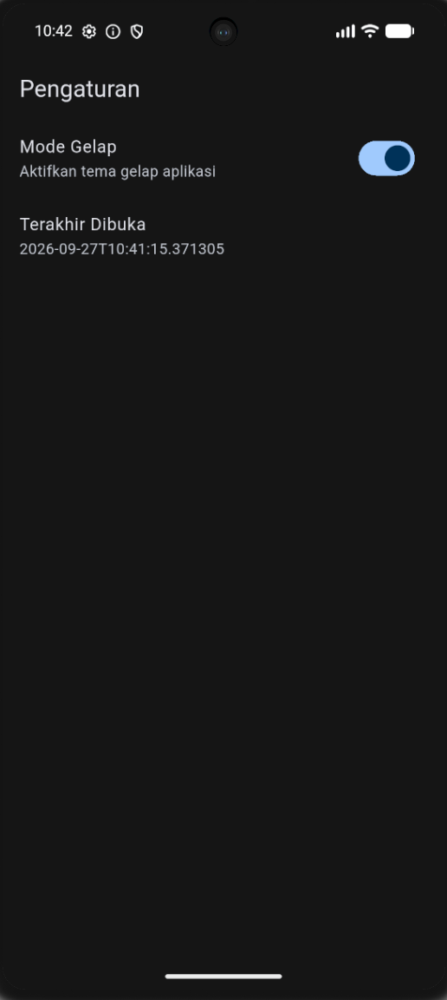

Setelah dilakukan hot restart, maka tampilan aplikasi akan tetap pada mode dark karena digunakan shared preferences.

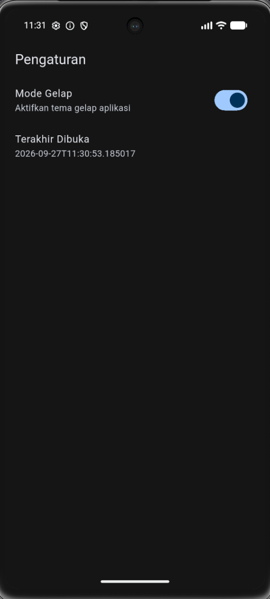

## Praktikum 2: SQLite dan repository catatan

Membuat model catatan.

Membuat pembuka database pada db.dart.

Membuat repository sebagai satu-satunya pintu akses data yang terdapat
pada note_repository.dart.

Membuat halaman catatan offline yang mengambil data melalui
notesProvider dan NoteRepository.

Berikut merupakan tampilan catatan yang telah tersimpan pada SQLite.

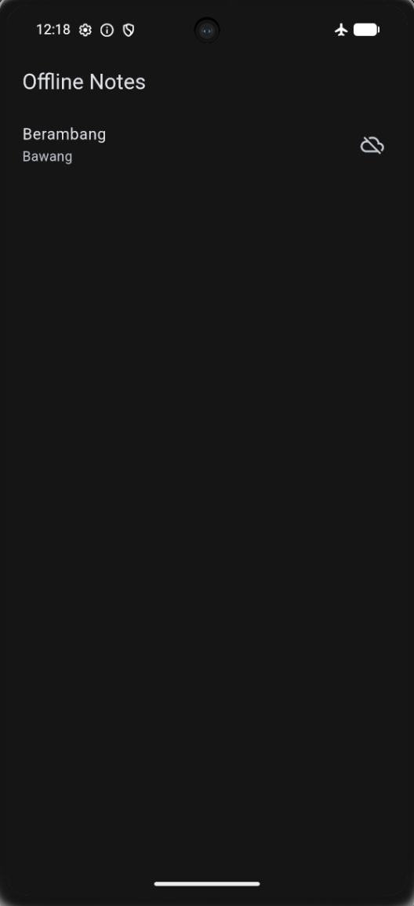

Catatan yang sebelumnya ditambahkan tetap tersimpan dan dapat
ditampilkan kembali karena data disimpan pada SQLite melalui
NoteRepository.

## Praktikum 3: Cache-first dan antrean sync

Menggunakan endpoint minggu 4 GET /posts untuk JSON placeholder

Berikut merupakan tampilan catatan setelah diambil data melalui API GET /posts pertama kali, namun tidak terhubung dengan internet.

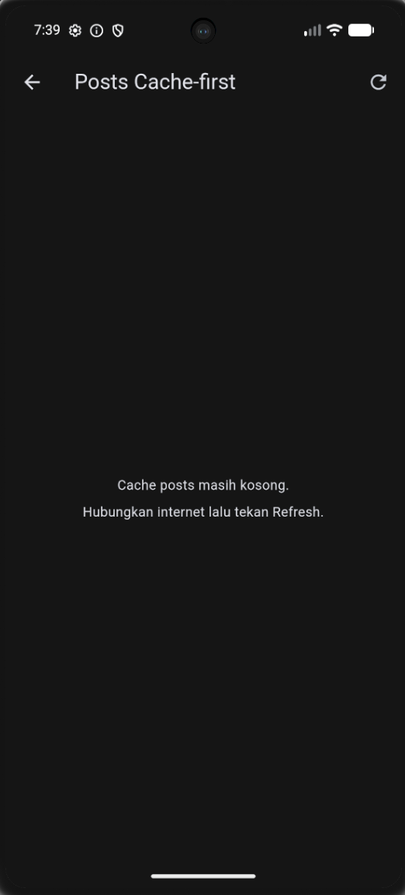

Berikut merupakan tampilannya ketika ditekan refresh dan terhubung dengan internet.

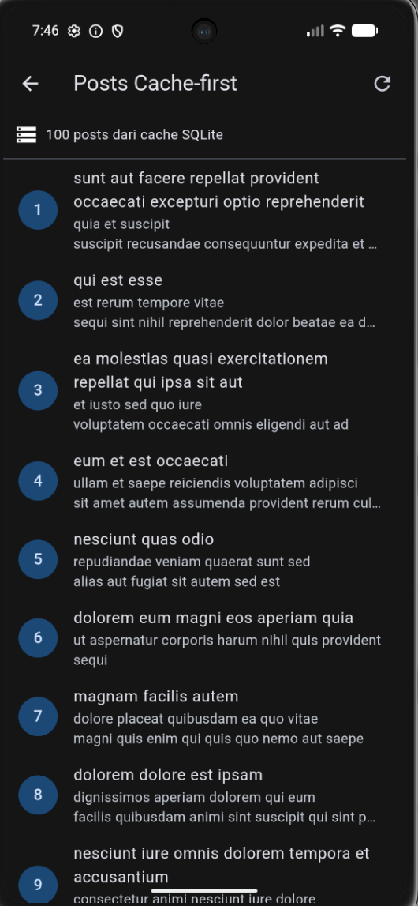

List tersebut tetap tersimpan di SQLite meskipun tidak terhubung dengan internet, dan ketika dilakukan hot restart pada aplikasi nya.

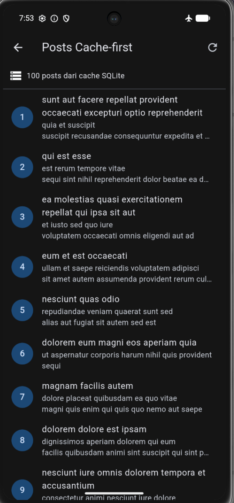

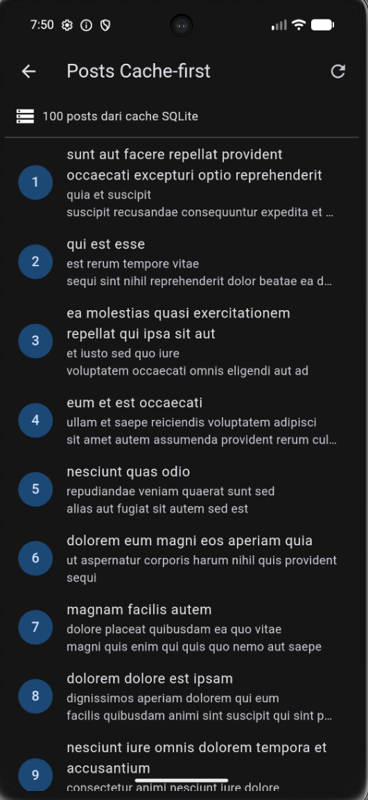

Menyinkronisasikan catatan kotor (dirty) 

Berikut merupakan tampilan badge dirty notes beserta jumlah yang masih dirty.

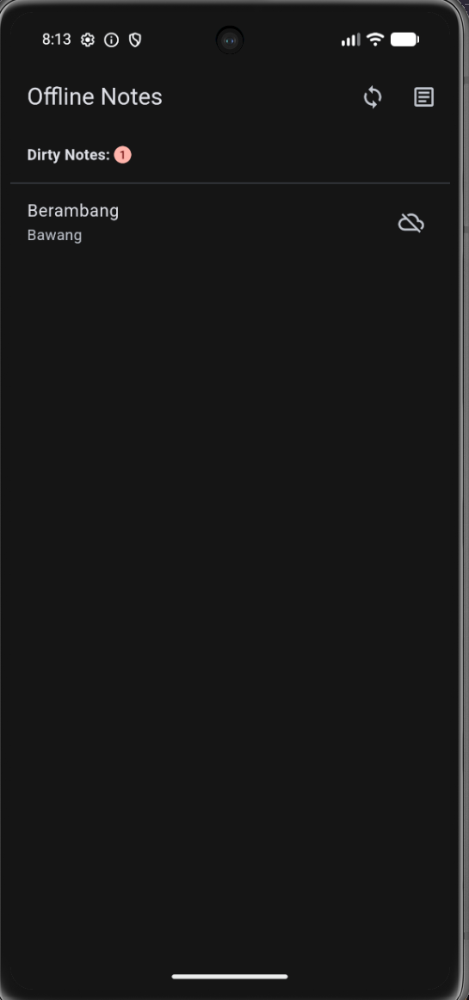

Berikut merupakan tampilannya setelah dilakukan sync.

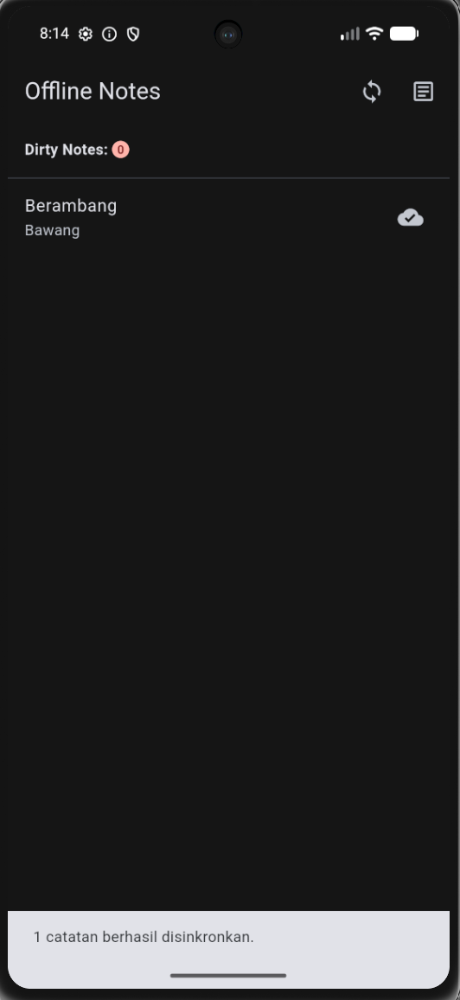

Simulasi offline determinisik

Berikut merupakan tampilan ketika force offline dimatikan.

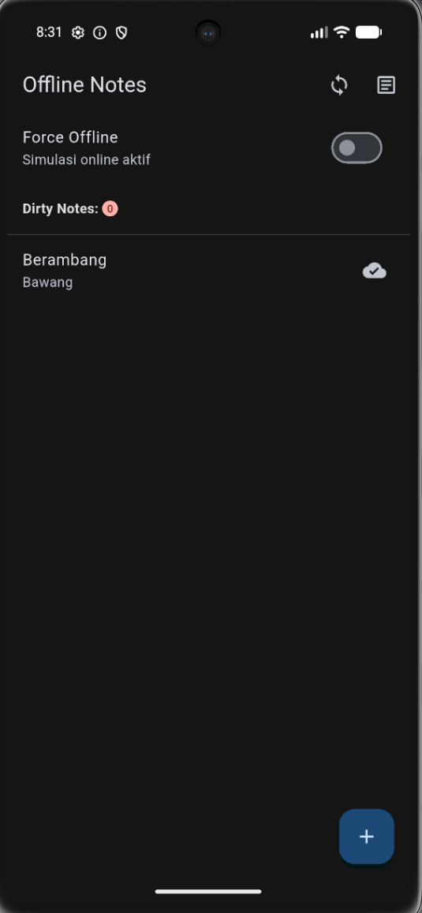

Berikut merupakan tampilan ketika force offline dinyalakan.

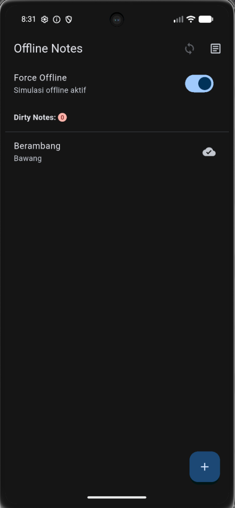

Berikut tampilan ketika dilakukan penambahan notes sebelum sync (Force offline mati).

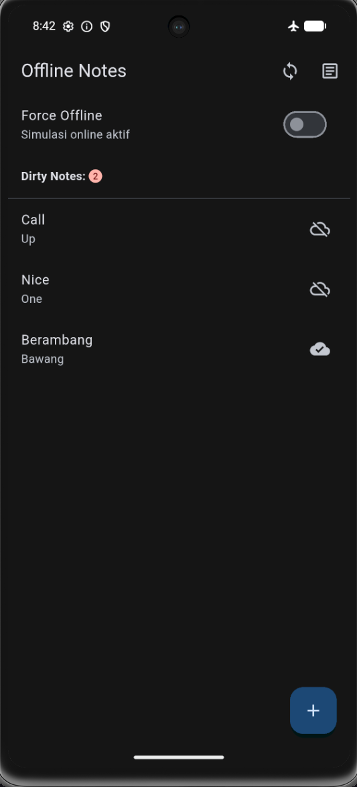

Dan berikut merupaakn tampilan ketika force Offline dimatikan dan dilakukan sync.

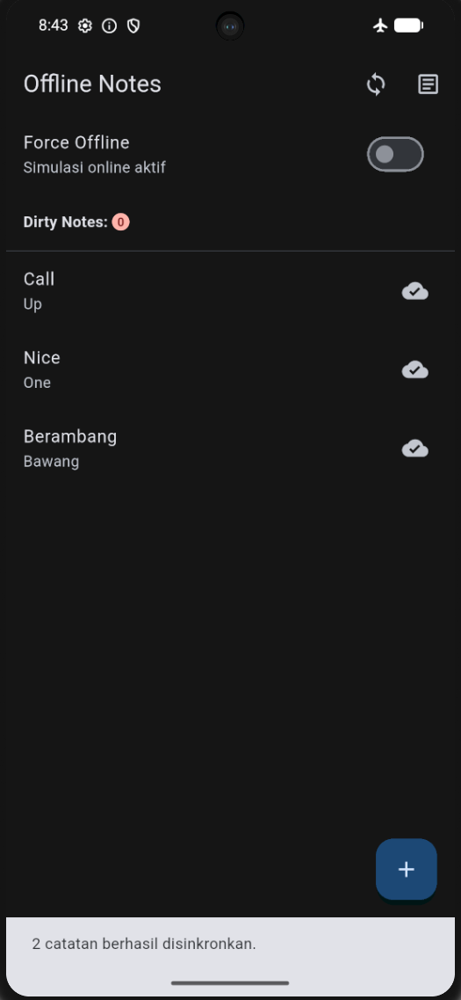

Saat Force Offline diaktifkan, catatan yang telah tersimpan tetap dapat ditampilkan dan catatan baru dapat disimpan ke SQLite dengan status dirty. Setelah koneksi disimulasikan kembali online dan proses sinkronisasi dijalankan, nilai dirty berubah dari 2 menjadi 0.

