# 06-week-6-authentication-security-fcm

## Tujuan 

1. Menjelaskan alur autentikasi (Firebase Auth / JWT / OAuth / Google Login) dan perbedaan ID token vs access token vs refresh token;
2. Menyimpan token secara aman dengan secure storage serta menerapkan token refresh otomatis;
3. Menjelaskan arsitektur FCM: app server, Firebase, dan perangkat;
4. Meminta notification permission dan mengelola token lifecycle (getToken, onTokenRefresh);
5. Membedakan notification payload vs data payload serta perilakunya pada state foreground, background, dan terminated;
6. Menangani klik notifikasi (deep link dengan GoRouter) dan topic messaging;
7. Menerapkan prinsip keamanan dasar aplikasi mobile (tidak menyimpan secret di kode, tidak log token).

## Praktikum 1: Login + Secure Storage + Token Refresh

Menyiapkan project

Menyimpan token yang aman

Membuat repository auth

Membut dio dengan refresh otomatis

Membuat provider auth dan guard route

Berikut merupakan tampilan aplikasi untuk pertama kalinya

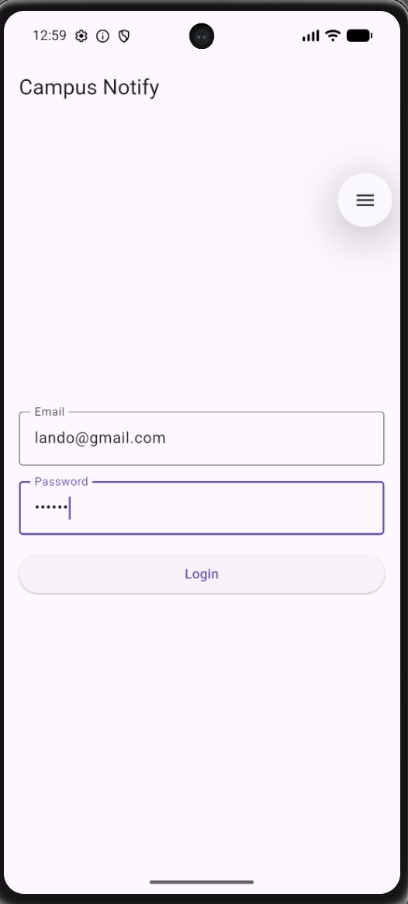

Berikut merupakan tampilan ketika menginputkan kridensial yang salah

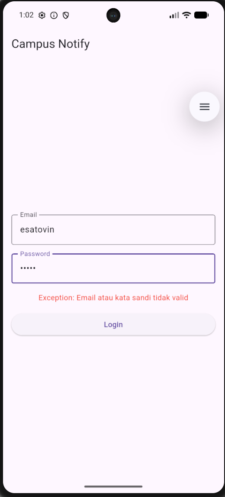

Berikut merupakan tampilan setelah berhasil login dengan valid

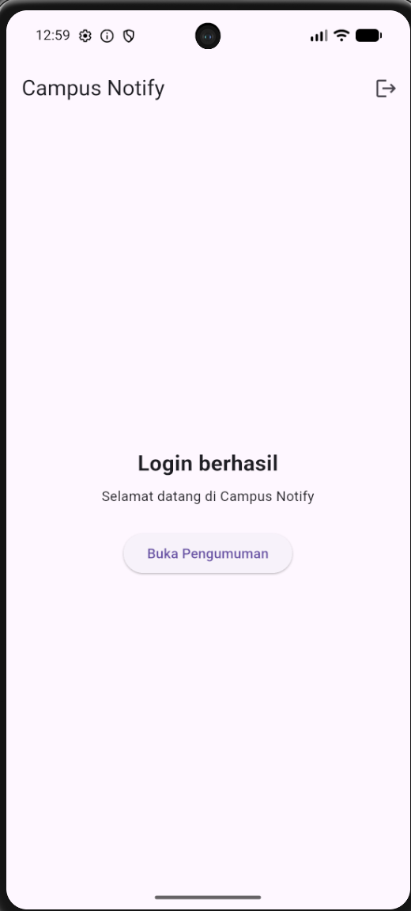

Berikut merupakan bukti routingnya berhasil setelah melakukan login

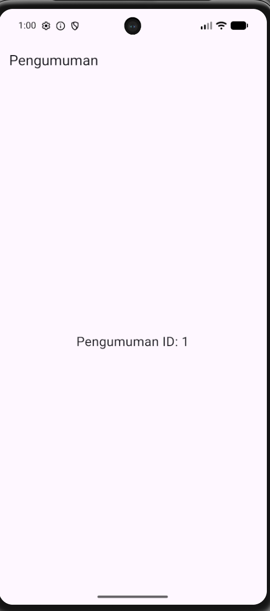

Setelah keluar dari aplikasi, lalu masuk kembali, akan langsung diarahkan ke beranda, sehingga tidak perlu login ulang.

## Praktikum 2: Firebase Cloud Messaging

Mendaftarkan aplikasi ke firebase

berikut merupakan tampilan dari firebase

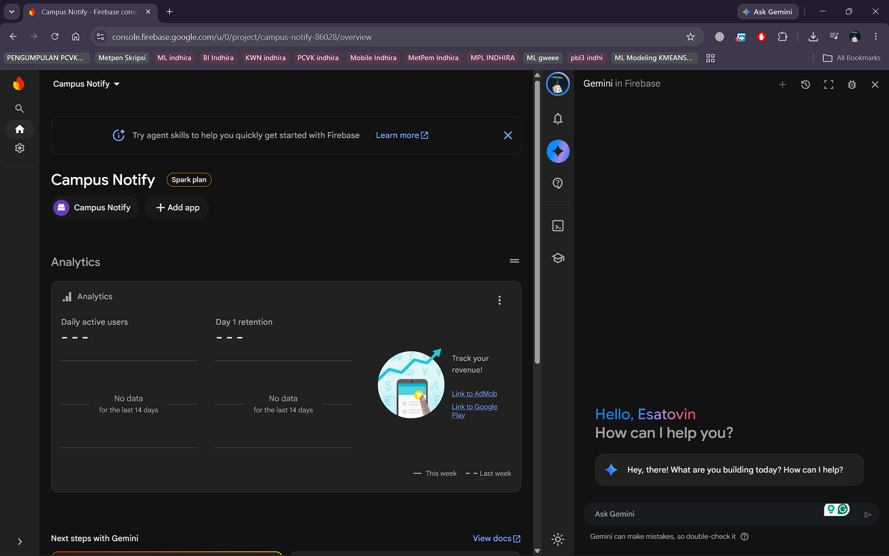

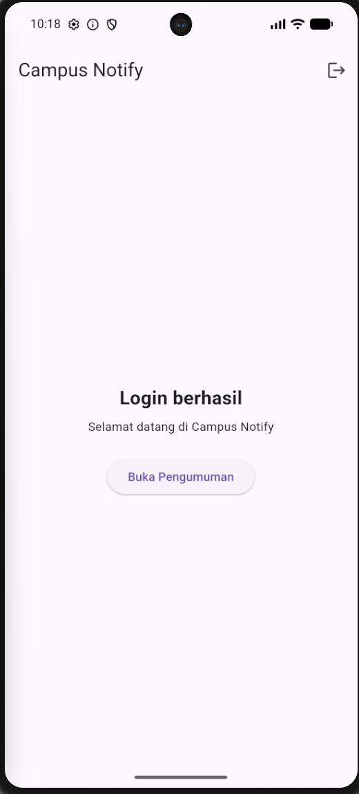

Meminta izin notifikasi

Berikut merupakan tampilan ketika meminta izin notifikasi dari aplikasi

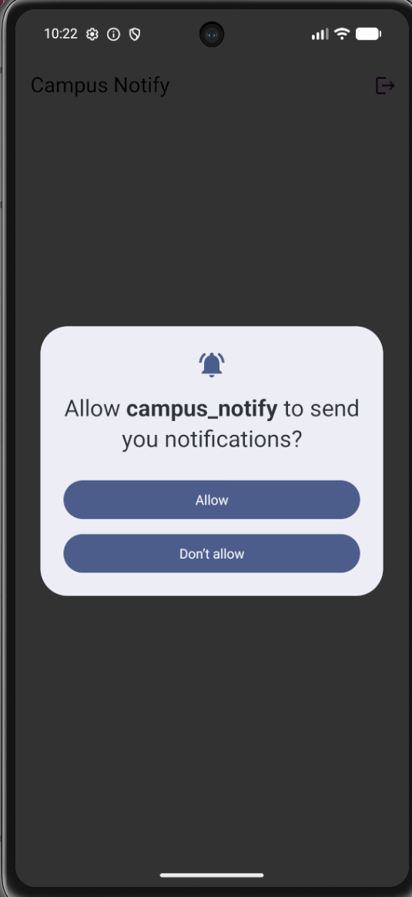

Mmebuat toke lifecycle

Berikut merupakan tampilan debug untuk token

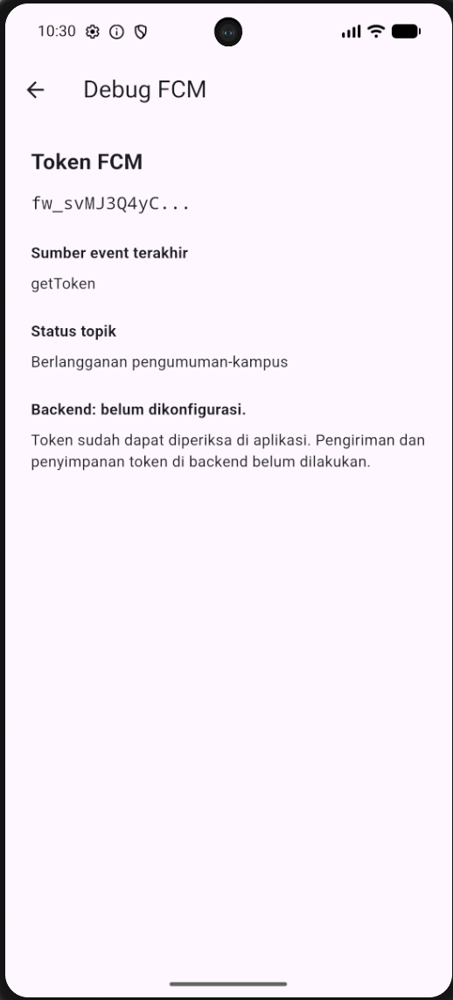

Menguji kirim pertama

Buka Firebase Console -> Messaging -> buat campaign notifikasi percobaan.
Masukkan title dan body, targetkan aplikasi Android Anda.
Kirim saat aplikasi dalam state background: banner sistem harus muncul. Klik banner: aplikasi terbuka.
Catat hasilnya sebagai bukti screenshots/fcm-console-test.png.

Berikut merupakan tampilan pada firebase untuk push notifications pertama

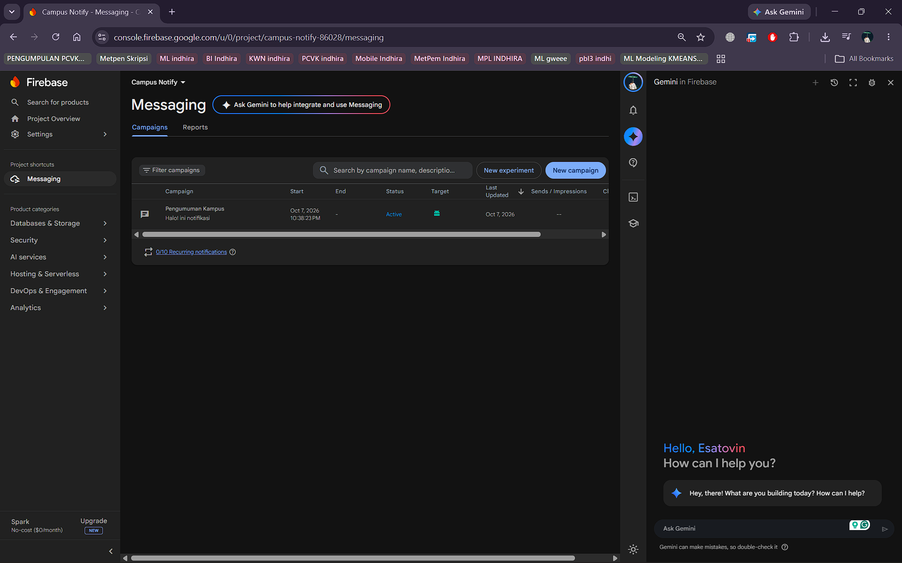

Berikut merupakan tampilan notifikasi, dan aplikasi yang dibuka setelah notifikasi diklik

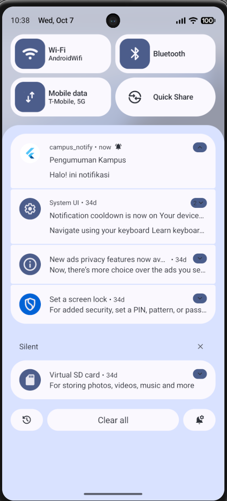

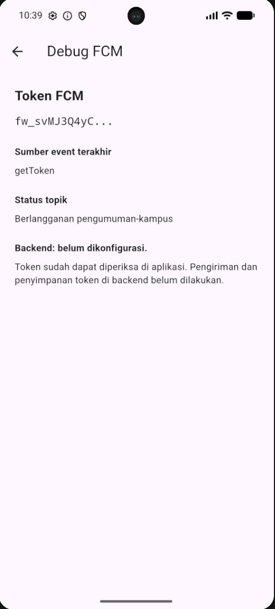

## Praktikum 3: Payload, Tiga App State, Klik dan Topik

Membuat Background Handler Top-Level

Menambahkan fungsi firebaseMessagingBackgroundHandler() pada file lib/messaging/push_service.dart. Fungsi diletakkan di luar kelas dan diberi anotasi @pragma('vm:entry-point').

Mendaftarkan handler melalui registerBackgroundHandler() pada main() sebelum menjalankan aplikasi. Handler digunakan untuk mencatat pesan background tanpa mengakses tampilan atau melakukan navigasi.

Membuat Tiga Handler dengan Payload Gabungan

Menggunakan payload gabungan yang berisi notification untuk judul dan isi notifikasi, serta data untuk menentukan halaman tujuan.

Menambahkan Custom data berikut saat mengirim notifikasi melalui Firebase Console:

| Key | Value |
| --- | --- |
| route | /pengumuman/3 |
| id | 3 |

Menguji Kondisi Foreground

Membuka aplikasi dan membiarkannya tampil di layar, kemudian mengirim notifikasi dari Firebase Console.

Berikut merupakan tampilan notifikasi lokal saat aplikasi berada di foreground.

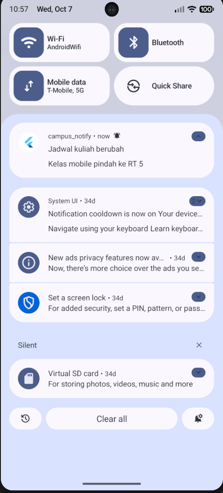

Mengetuk notifikasi untuk membuka halaman pengumuman dengan ID 3.

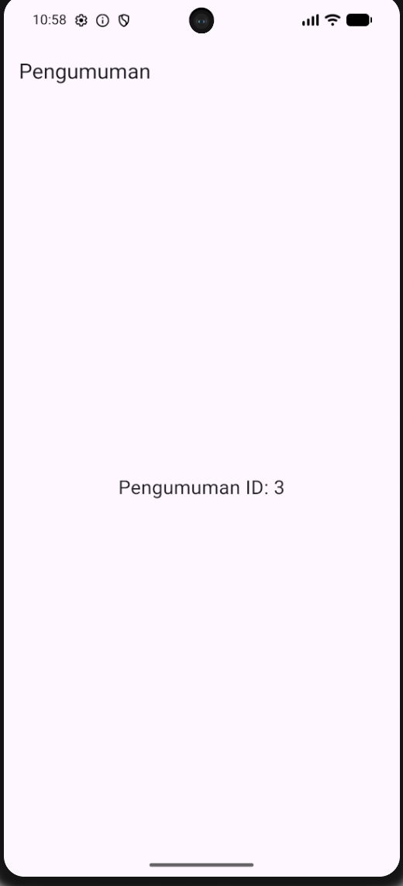

Menguji Kondisi Background

Menekan tombol Home pada emulator untuk memindahkan aplikasi ke background, kemudian mengirim notifikasi baru dengan payload yang sama.

Berikut merupakan tampilan notifikasi sistem saat aplikasi berada di background.

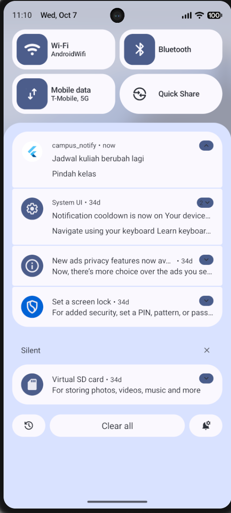

Mengetuk notifikasi untuk membuka halaman pengumuman dengan ID 3.

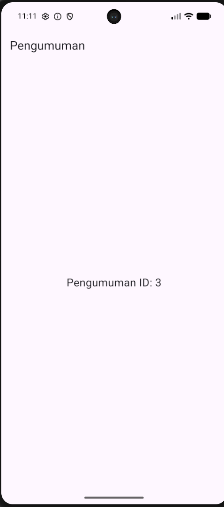

Menguji Kondisi Terminated

Menutup aplikasi dengan menggeser kartu Campus Notify pada Recent Apps, kemudian mengirim notifikasi baru dengan payload yang sama.

Berikut merupakan tampilan notifikasi ketika aplikasi sudah ditutup.

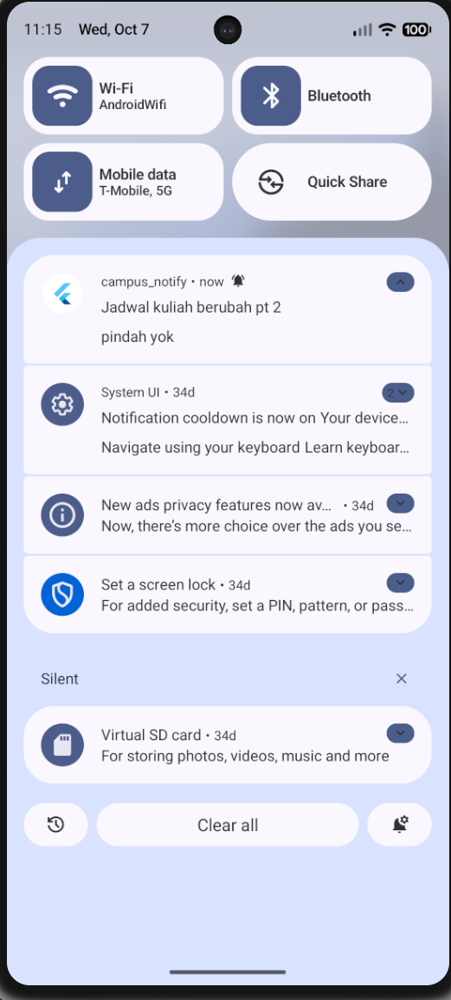

Mengetuk notifikasi untuk menjalankan aplikasi dan membuka halaman pengumuman dengan ID 3

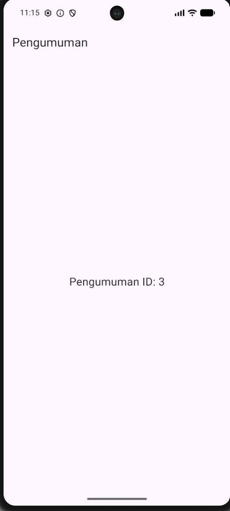

### Matriks Pengujian

| State | Yang Diharapkan | Cara Uji | Hasil Pengujian |
| --- | --- | --- | --- |
| Foreground | Notifikasi lokal muncul dan klik membuka /pengumuman/3 | Membuka aplikasi, mengirim pesan, lalu mengetuk notifikasi | Notifikasi diterima dan klik membuka pengumuman ID 3 |
| Background | Notifikasi sistem muncul dan klik membuka /pengumuman/3 | Menekan Home, mengirim pesan, lalu mengetuk notifikasi | Notifikasi diterima dan klik membuka pengumuman ID 3 |
| Terminated | Aplikasi terbuka ke /pengumuman/3 melalui getInitialMessage() | Menutup aplikasi melalui Recent Apps, mengirim pesan, lalu mengetuk notifikasi | Aplikasi berjalan kembali dan membuka pengumuman ID 3 |

Topic Messaging

Menambahkan tombol Subscribe dan Unsubscribe pada halaman Debug untuk mengatur langganan topik pengumuman-kampus.

Menggunakan subscribeToTopic() untuk berlangganan dan unsubscribeFromTopic() untuk berhenti berlangganan.

Berikut merupakan tampilan tombol pengaturan topik pada halaman Debug.

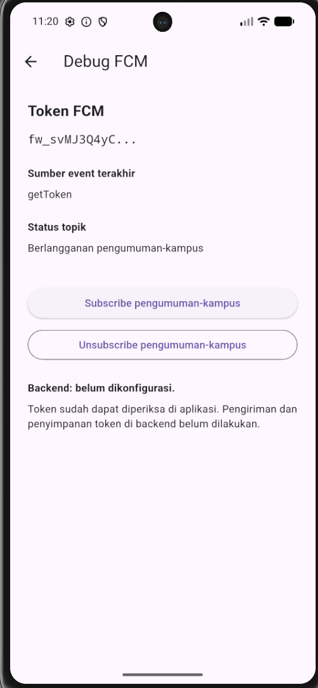

Memilih Topic dengan nama pengumuman-kampus sebagai target pengiriman pada Firebase Console.

Uji Topik A: Subscribe

Menekan tombol Subscribe dan menunggu proses berhasil, kemudian mengirim notifikasi berjudul “Uji Topik A”.

Berikut merupakan bukti pengujian saat aplikasi berlangganan topik.

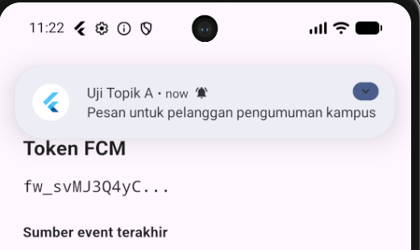

Uji Topik B: Unsubscribe

Menekan tombol Unsubscribe dan memastikan status berubah menjadi “Tidak berlangganan pengumuman-kampus”.

Menghapus notifikasi lama, kemudian mengirim pesan baru berjudul “Uji Topik B” ke topik yang sama. Mengamati panel notifikasi dan terminal tanpa melakukan restart aplikasi.

Berikut merupakan panel notifikasi selama pengamatan Uji Topik B.

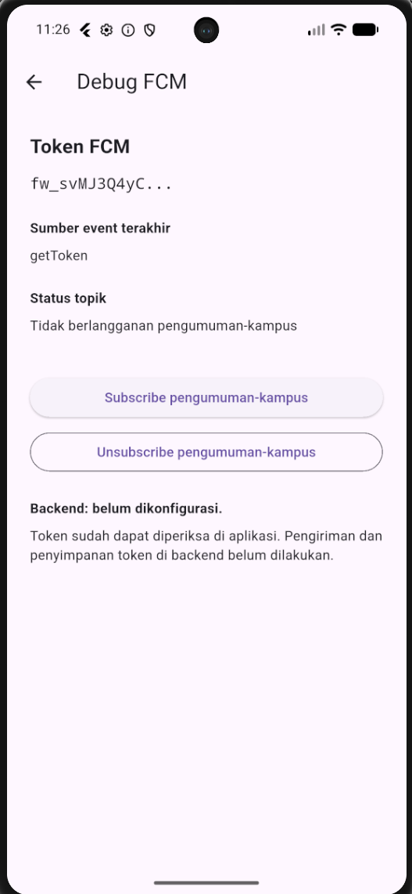

Uji Topik C: Subscribe Kembali

Menekan tombol Subscribe kembali, kemudian mengirim pesan baru berjudul “Uji Topik C ke topik yang sama.

Berikut merupakan bukti pengujian setelah berlangganan kembali.

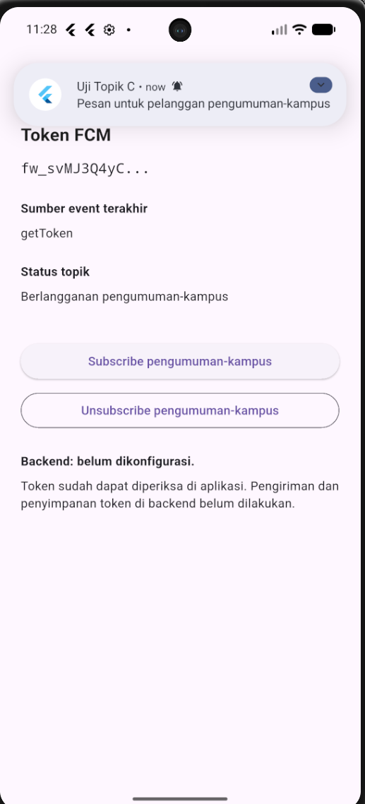

#### Hasil Pengujian Topik

| Pengujian | Status Langganan | Yang Diharapkan | Hasil Pengamatan |
| --- | --- | --- | --- |
| Uji Topik A | Subscribe | Pesan diterima | [Isi sesuai hasil pengujian] |
| Uji Topik B | Unsubscribe | Pesan tidak diterima | [Isi hasil dan durasi pengamatan] |
| Uji Topik C | Subscribe kembali | Pesan kembali diterima | [Isi sesuai hasil pengujian] |

### Catatan implementasi `PushService`

`lib/messaging/push_service.dart` menyediakan satu `PushService` untuk:

- meminta izin notifikasi, mengambil token awal dengan `getToken`, dan
  mendaftarkan token ke `POST /devices`;
- mengirim token baru dari `onTokenRefresh` ke endpoint yang sama;
- menampilkan notifikasi lokal secara manual saat `onMessage` diterima;
- meneruskan `onMessageOpenedApp` dan `getInitialMessage` ke GoRouter
  menggunakan `data.route`;
- subscribe dan unsubscribe ke topik `pengumuman-kampus`.

Perbedaan platform ditandai langsung di source:

- **Android 13+** membutuhkan permission `POST_NOTIFICATIONS` pada
  `AndroidManifest.xml`. `PushService` juga memanggil
  `requestNotificationsPermission()` pada plugin local notifications dan
  membuat notification channel Android.
- **iOS** menggunakan permission FCM/APNs melalui `requestPermission()` dan
  konfigurasi `DarwinInitializationSettings`. Permission lokal pada plugin
  diatur `false` karena prompt ditangani oleh FCM.

`firebaseMessagingBackgroundHandler` adalah fungsi top-level dengan
`@pragma('vm:entry-point')`. Background isolate, callback notifikasi, dan
service messaging **tidak boleh mengakses `BuildContext`, `WidgetRef`, atau
melakukan navigasi langsung**. Callback route dikirim ke `main.dart`, lalu
GoRouter melakukan navigasi pada layer UI setelah status login siap.

## AI Challenge

1. Agent yang dipakai: Copilot

2. Prompt yang digunakan:

Aplikasi Flutter Campus Notification App.
Stack: firebase_messaging, flutter_local_notifications,
flutter_secure_storage, go_router, Riverpod.
Buatkan PushService dengan:
- requestPermission + getToken + onTokenRefresh (kirim ke POST /devices)
- onMessage (tampilkan local notification manual)
- onMessageOpenedApp + getInitialMessage (navigasi ke data.route)
- subscribe/unsubscribe topic pengumuman-kampus
- background handler top-level dengan @pragma('vm:entry-point')
Tandai bagian yang BERBEDA untuk Android 13+ vs iOS,
dan bagian yang tidak boleh mengakses BuildContext.

3. Output awal AI:

    main.dart
        import 'dart:async';

import 'package:firebase_core/firebase_core.dart';
import 'package:flutter/material.dart';
import 'package:flutter_riverpod/flutter_riverpod.dart';
import 'package:go_router/go_router.dart';

import 'messaging/push_service.dart';
import 'pages/announcement_page.dart';
import 'pages/debug_page.dart';
import 'pages/home_page.dart';
import 'pages/login_page.dart';
import 'providers/auth_provider.dart';

Future<void> main() async {
  WidgetsFlutterBinding.ensureInitialized();

  await Firebase.initializeApp();

  registerBackgroundHandler();

  runApp(
    const ProviderScope(
      child: MyApp(),
    ),
  );
}

class MyApp extends ConsumerStatefulWidget {
  const MyApp({super.key});

  @override
  ConsumerState<MyApp> createState() => _MyAppState();
}

class _MyAppState extends ConsumerState<MyApp> {
  late final GoRouter router;
  late final PushService _pushService;
  String? _pendingNotificationRoute;

  @override
  void initState() {
    super.initState();

    _pushService = PushService(api: ref.read(apiClientProvider));

    router = GoRouter(
      initialLocation: '/login',
      redirect: (context, state) {
        final authState = ref.read(authStateProvider);

        if (authState.isLoading) {
          return null;
        }

        final loggedIn = authState.asData?.value ?? false;
        final goingLogin = state.matchedLocation == '/login';

        if (!loggedIn) {
          return goingLogin ? null : '/login';
        }

        // Setelah login siap, buka tujuan notifikasi yang disimpan.
        final pendingRoute = _pendingNotificationRoute;

        if (pendingRoute != null) {
          _pendingNotificationRoute = null;

          if (state.matchedLocation != pendingRoute) {
            return pendingRoute;
          }

          return null;
        }

        if (goingLogin) {
          return '/';
        }

        return null;
      },
      routes: [
        GoRoute(
          path: '/login',
          builder: (context, state) => const LoginPage(),
        ),
        GoRoute(
          path: '/',
          builder: (context, state) => const HomePage(),
        ),
        GoRoute(
          path: '/debug',
          builder: (context, state) => const DebugPage(),
        ),
        GoRoute(
          path: '/pengumuman/:id',
          builder: (context, state) {
            return AnnouncementPage(
              id: state.pathParameters['id'] ?? '',
            );
          },
        ),
      ],
    );

    WidgetsBinding.instance.addPostFrameCallback((_) {
      if (!mounted) return;

      unawaited(_initMessaging());
    });
  }

  Future<void> _initMessaging() async {
    try {
      void goFromNotification(String route) {
        if (!mounted) return;

        // Simpan tujuan, lalu minta router memeriksa status login.
        _pendingNotificationRoute = route;
        router.refresh();
      }

      await _pushService.initialize(onRoute: goFromNotification);
      debugPrint('Inisialisasi FCM dan notifikasi lokal selesai.');
    } catch (error) {
      debugPrint('Inisialisasi messaging gagal: $error');
    }
  }

  @override
  Widget build(BuildContext context) {
    ref.listen(authStateProvider, (previous, next) {
      router.refresh();
    });

    return MaterialApp.router(
      title: 'Campus Notify',
      debugShowCheckedModeBanner: false,
      routerConfig: router,
    );
  }

  @override
  void dispose() {
    unawaited(_pushService.dispose());

    router.dispose();
    super.dispose();
  }
}

    debug_page.dart
        import 'package:flutter/material.dart';
import 'package:flutter_riverpod/flutter_riverpod.dart';

import '../messaging/push_service.dart';
import '../providers/auth_provider.dart';

class DebugPage extends ConsumerWidget {
  const DebugPage({super.key});

  @override
  Widget build(BuildContext context, WidgetRef ref) {
    final pushService = PushService(api: ref.read(apiClientProvider));
    return Scaffold(
      appBar: AppBar(
        title: const Text('Debug FCM'),
      ),
      body: ListView(
        padding: const EdgeInsets.all(24),
        children: [
          const Text(
            'Token FCM',
            style: TextStyle(
              fontSize: 20,
              fontWeight: FontWeight.bold,
            ),
          ),
          const SizedBox(height: 12),
          ValueListenableBuilder<String>(
            valueListenable: fcmTokenPreview,
            builder: (context, value, child) {
              return Text(
                value,
                style: const TextStyle(
                  fontFamily: 'monospace',
                  fontSize: 16,
                ),
              );
            },
          ),
          const SizedBox(height: 24),
          const Text(
            'Sumber event terakhir',
            style: TextStyle(fontWeight: FontWeight.bold),
          ),
          const SizedBox(height: 8),
          ValueListenableBuilder<String>(
            valueListenable: fcmTokenSource,
            builder: (context, value, child) {
              return Text(value);
            },
          ),
          const SizedBox(height: 24),
          const Text(
            'Status topik',
            style: TextStyle(fontWeight: FontWeight.bold),
          ),
          const SizedBox(height: 8),
          ValueListenableBuilder<String>(
            valueListenable: fcmTopicStatus,
            builder: (context, value, child) {
              return Text(value);
            },
          ),
          const SizedBox(height: 24),
          const SizedBox(height: 16),
          ElevatedButton(
            onPressed: () async {
              try {
                await pushService.subscribePengumuman();

                if (!context.mounted) return;

                ScaffoldMessenger.of(context).showSnackBar(
                  const SnackBar(
                    content: Text('Berhasil berlangganan topik.'),
                  ),
                );
              } catch (error) {
                if (!context.mounted) return;

                ScaffoldMessenger.of(context).showSnackBar(
                  SnackBar(
                    content: Text('Subscribe gagal: $error'),
                  ),
                );
              }
            },
            child: const Text('Subscribe pengumuman-kampus'),
          ),
          const SizedBox(height: 8),
          OutlinedButton(
            onPressed: () async {
              try {
                await pushService.unsubscribePengumuman();

                if (!context.mounted) return;

                ScaffoldMessenger.of(context).showSnackBar(
                  const SnackBar(
                    content: Text('Berhasil berhenti berlangganan topik.'),
                  ),
                );
              } catch (error) {
                if (!context.mounted) return;

                ScaffoldMessenger.of(context).showSnackBar(
                  SnackBar(
                    content: Text('Unsubscribe gagal: $error'),
                  ),
                );
              }
            },
            child: const Text('Unsubscribe pengumuman-kampus'),
          ),
          const SizedBox(height: 24),
          const Text(
            'Backend: token didaftarkan ke POST /devices.',
            style: TextStyle(fontWeight: FontWeight.bold),
          ),
          const SizedBox(height: 8),
          const Text(
            'Token FCM dikirim ke backend setelah izin diberikan '
            'dan setiap kali token berubah.',
          ),
        ],
      ),
    );
  }
}

    push_service.dart
        import 'dart:async';

import 'package:dio/dio.dart';
import 'package:firebase_core/firebase_core.dart';
import 'package:firebase_messaging/firebase_messaging.dart';
import 'package:flutter/foundation.dart';
import 'package:flutter_local_notifications/flutter_local_notifications.dart';

const _campusTopic = 'pengumuman-kampus';

@pragma('vm:entry-point')
Future<void> firebaseMessagingBackgroundHandler(RemoteMessage message) async {
  // Background isolate: do not use BuildContext, ref, or navigate here.
  await Firebase.initializeApp();
  debugPrint('FCM background diterima: ${message.messageId}');
}

void registerBackgroundHandler() {
  FirebaseMessaging.onBackgroundMessage(firebaseMessagingBackgroundHandler);
}

final fcmTokenPreview = ValueNotifier<String>('Belum tersedia');
final fcmTokenSource = ValueNotifier<String>('Belum ada event token');
final fcmTopicStatus = ValueNotifier<String>('Belum berlangganan');

class PushService {
  PushService({
    required this.api,
    FirebaseMessaging? messaging,
    FlutterLocalNotificationsPlugin? localNotifications,
  })  : _messaging = messaging ?? FirebaseMessaging.instance,
        _local = localNotifications ?? FlutterLocalNotificationsPlugin();

  final Dio api;
  final FirebaseMessaging _messaging;
  final FlutterLocalNotificationsPlugin _local;

  StreamSubscription<String>? _tokenSubscription;
  StreamSubscription<RemoteMessage>? _foregroundSubscription;
  StreamSubscription<RemoteMessage>? _openedAppSubscription;
  String? _pendingLocalRoute;

  Future<void> initialize({
    required void Function(String route) onRoute,
  }) async {
    await _initializeLocalNotifications(onRoute);
    await _listenForMessages(onRoute);
    await _handleTerminatedMessage(onRoute);

    final granted = await requestPermission();
    if (!granted) {
      debugPrint('Izin notifikasi belum diberikan.');
      return;
    }

    await _initializeToken();
    await subscribePengumuman();
  }

  Future<bool> requestPermission() async {
    // iOS: this displays the APNs permission prompt and supports provisional
    // authorization. Android 13+: POST_NOTIFICATIONS is requested by FCM.
    final settings = await _messaging.requestPermission(
      alert: true,
      badge: true,
      sound: true,
      announcement: false,
      carPlay: false,
      criticalAlert: false,
      provisional: true,
    );

    // Android 13+: keep the explicit plugin request for local notifications.
    // It is harmless on older Android versions and a no-op on iOS.
    await _local
        .resolvePlatformSpecificImplementation<
            AndroidFlutterLocalNotificationsPlugin>()
        ?.requestNotificationsPermission();

    return settings.authorizationStatus == AuthorizationStatus.authorized ||
        settings.authorizationStatus == AuthorizationStatus.provisional;
  }

  Future<void> _initializeToken() async {
    await _tokenSubscription?.cancel();

    _tokenSubscription = _messaging.onTokenRefresh.listen(
      (token) async {
        try {
          await _registerDevice(token, source: 'onTokenRefresh');
        } catch (error) {
          debugPrint('Registrasi token FCM yang diperbarui gagal: $error');
        }
      },
      onError: (Object error) {
        debugPrint('Listener token FCM mengalami kesalahan: $error');
      },
    );

    final token = await _messaging.getToken();
    if (token != null) {
      await _registerDevice(token, source: 'getToken');
    } else {
      fcmTokenPreview.value = 'Token belum tersedia';
    }
  }

  Future<void> _registerDevice(
    String token, {
    required String source,
  }) async {
    fcmTokenPreview.value = _shortenToken(token);
    fcmTokenSource.value = source;

    await api.post<void>(
      '/devices',
      data: <String, String>{
        'token': token,
        'platform': defaultTargetPlatform.name,
      },
    );
    debugPrint('Token FCM [$source] berhasil didaftarkan ke backend.');
  }

  Future<void> _initializeLocalNotifications(
    void Function(String route) onRoute,
  ) async {
    const settings = InitializationSettings(
      android: AndroidInitializationSettings('@mipmap/ic_launcher'),
      iOS: DarwinInitializationSettings(
        requestAlertPermission: false,
        requestBadgePermission: false,
        requestSoundPermission: false,
      ),
    );

    await _local.initialize(
      settings: settings,
      onDidReceiveNotificationResponse: (response) {
        // Navigation is delegated to the UI layer; this service has no
        // BuildContext and is safe to use from notification callbacks.
        onRoute(_notificationRoute(response.payload));
      },
    );

    const channel = AndroidNotificationChannel(
      'pengumuman',
      'Pengumuman Kampus',
      description: 'Notifikasi pengumuman kampus',
      importance: Importance.high,
    );

    await _local
        .resolvePlatformSpecificImplementation<
            AndroidFlutterLocalNotificationsPlugin>()
        ?.createNotificationChannel(channel);

    final launchDetails = await _local.getNotificationAppLaunchDetails();
    if (launchDetails?.didNotificationLaunchApp ?? false) {
      _pendingLocalRoute = _notificationRoute(
        launchDetails?.notificationResponse?.payload,
      );
    }
  }

  Future<void> _listenForMessages(
    void Function(String route) onRoute,
  ) async {
    await _foregroundSubscription?.cancel();
    await _openedAppSubscription?.cancel();

    _foregroundSubscription = FirebaseMessaging.onMessage.listen(
      (message) async {
        try {
          final route = _notificationRoute(message.data['route']?.toString());
          const androidDetails = AndroidNotificationDetails(
            'pengumuman',
            'Pengumuman Kampus',
            channelDescription: 'Notifikasi pengumuman kampus',
            importance: Importance.high,
            priority: Priority.high,
          );
          const iosDetails = DarwinNotificationDetails();

          await _local.show(
            id: message.hashCode & 0x7fffffff,
            title: message.notification?.title ?? 'Pengumuman',
            body: message.notification?.body ?? '',
            notificationDetails: const NotificationDetails(
              android: androidDetails,
              iOS: iosDetails,
            ),
            payload: route,
          );
        } catch (error) {
          debugPrint('Gagal menampilkan notifikasi lokal: $error');
        }
      },
    );

    _openedAppSubscription = FirebaseMessaging.onMessageOpenedApp.listen(
      (message) => onRoute(_notificationRoute(message.data['route']?.toString())),
    );
  }

  Future<void> _handleTerminatedMessage(
    void Function(String route) onRoute,
  ) async {
    final initial = await _messaging.getInitialMessage();
    if (initial != null) {
      onRoute(_notificationRoute(initial.data['route']?.toString()));
    } else if (_pendingLocalRoute != null) {
      onRoute(_pendingLocalRoute!);
    }
    _pendingLocalRoute = null;
  }

  Future<void> subscribePengumuman() async {
    await _messaging.subscribeToTopic(_campusTopic);
    fcmTopicStatus.value = 'Berlangganan $_campusTopic';
  }

  Future<void> unsubscribePengumuman() async {
    await _messaging.unsubscribeFromTopic(_campusTopic);
    fcmTopicStatus.value = 'Tidak berlangganan $_campusTopic';
  }

  Future<void> dispose() async {
    await _tokenSubscription?.cancel();
    await _foregroundSubscription?.cancel();
    await _openedAppSubscription?.cancel();
    _tokenSubscription = null;
    _foregroundSubscription = null;
    _openedAppSubscription = null;
  }

  String _shortenToken(String token) {
    final length = token.length < 12 ? token.length : 12;
    return '${token.substring(0, length)}...';
  }

  String _notificationRoute(String? route) {
    if (route == '/') return '/';
    if (route != null && RegExp(r'^/pengumuman/[0-9]+$').hasMatch(route)) {
      return route;
    }
    return '/';
  }
}

    api_client.dart
        import 'package:dio/dio.dart';

import 'auth_repository.dart';
import 'token_store.dart';

Dio buildApiClient(TokenStore store, AuthRepository auth) {
  final dio = Dio(BaseOptions(baseUrl: 'https://example-campus-api.test'));
  dio.interceptors.add(
    InterceptorsWrapper(
      onRequest: (options, handler) async {
        final access = await store.readAccess();
        if (access != null) {
          options.headers['Authorization'] = '******';
        }
        handler.next(options);
      },
      onError: (e, handler) async {
        if (e.response?.statusCode == 401) {
          final refresh = await store.readRefresh();
          if (refresh == null) return handler.next(e);
          try {
            final renewed = await auth.refresh(refresh);
            await store.save(access: renewed, refresh: refresh);
            final retry = await dio.fetch(
              e.requestOptions
                ..headers['Authorization'] = '******',
            );
            return handler.resolve(retry);
          } catch (_) {
            await store.clear();
          }
        }
        handler.next(e);
      },
    ),
  );
  return dio;
}

4. AI Verification Checklist

- Apakah background handler berupa fungsi top-level dengan @pragma('vm:entry-point')? (tolak jika berupa method kelas).

Jawaban: Ya. Fungsi firebaseMessagingBackgroundHandler() berada di luar kelas dan memiliki anotasi @pragma('vm:entry-point'). Handler tidak mengakses BuildContext atau melakukan navigasi.

- Apakah onTokenRefresh benar-benar mengirim token baru ke backend, bukan hanya dicetak ke log?

Jawaban: Secara kode, ya. Listener memanggil _registerDevice() yang menjalankan api.post('/devices'). Namun, keberhasilan pengiriman belum terbukti karena base URL masih menggunakan alamat contoh https://example-campus-api.test.

- Apakah foreground memakai local notification manual? (tanpa ini banner tidak muncul saat aplikasi terbuka).

Jawaban: Ya. Listener FirebaseMessaging.onMessage memanggil _local.show() untuk menampilkan notifikasi lokal beserta payload rute tujuan.

- Apakah klik dari ketiga state (foreground/background/terminated) masuk ke rute yang benar? Buktikan dengan tabel pengujian.

Jawaban: 
| State | Cara pengujian | Hasil |
|---|---|---|
| Foreground | Membuka aplikasi, mengirim pesan, lalu mengetuk notifikasi lokal | Membuka /pengumuman/3 |
| Background | Menekan Home, mengirim pesan, lalu mengetuk notifikasi | Membuka /pengumuman/3 |
| Terminated | Menutup aplikasi melalui Recent Apps, mengirim pesan, lalu mengetuk notifikasi | Aplikasi berjalan kembali dan membuka /pengumuman/3 |

- Apakah token/secret tidak di-hardcode dan tidak di-log penuh? Perbaiki bila AI melanggarnya.

Jawaban: Token FCM diperoleh secara dinamis, sedangkan token autentikasi dibaca melalui TokenStore. Token FCM yang ditampilkan hanya 12 karakter pertama. Jika nilai '******' benar-benar terdapat pada header Authorization, nilainya perlu diganti menjadi Bearer $access dan Bearer $renewed saat retry. Log error dan interceptor juga perlu diperiksa agar tidak membocorkan token atau header autentikasi.

- Keputusan final dan alasan teknis Anda, boleh berbeda dari saran AI selama berargumen.

Jawaban: Saya menerima draf AI sebagai dasar implementasi, tetapi belum sebagai hasil akhir. Handler pesan dan navigasi sudah tersedia, sedangkan pengiriman token ke backend belum terbukti berhasil. Perbaikan diperlukan pada konfigurasi backend, status registrasi token, penggunaan satu instance PushService, dan pembatasan retry autentikasi. Setelah diperbaiki, saya perlu mengulang pengujian sebelum menyatakan seluruh checklist terpenuhi.

## Refactoring, testing, dan error umum

1. Pindahkan semua string rute (/login, /pengumuman/:id) ke satu file lib/routes.dart agar deep link dari FCM dan GoRouter memakai konstanta yang sama.

2. Ekstrak parsing RemoteMessage -> route ke fungsi murni routeFromMessage(Map<String, dynamic> data) agar bisa diunit-test tanpa Firebase.

3. Pindahkan pemetaan DioException -> pesan ramah pengguna (401, timeout, offline) ke lib/data/api_errors.dart agar UI hanya menerima pesan, bukan exception mentah.

## Mini Project

Login (mock/Firebase Auth) dengan guard route: belum login selalu diarahkan ke /login.
Token disimpan di secure storage; Dio otomatis refresh sekali saat 401 dan logout bila refresh mati.
FCM terintegrasi: permission, getToken + onTokenRefresh terkirim ke backend (atau didokumentasikan endpoint POST /devices), dan subscribe topik pengumuman-kampus.
Notifikasi gabungan notification + data; klik membuka /pengumuman/:id pada ketiga app state. Isi tabel pengujian foreground/background/terminated di README.
Screenshot bukti (token terpotong, banner tiap state, halaman tujuan deep link) di folder screenshots/.
Sertakan minimal 2 test yang lulus (parsing route + logika sesi/refresh).
Kerjakan AI Challenge dan dokumentasikan prompt, output awal AI, perbaikan manual, dan alasan teknis di docs/.
Push ke repository portfolio pada folder 06-week-6-authentication-security-fcm/ dengan struktur lib/, test/, docs/, README.md, dan screenshots/. README menjelaskan tujuan, fitur utama, stack teknologi, cara menjalankan, dan hasil yang dicapai.
Refleksi

## Refleksi

1. Mengapa refresh token tidak boleh disimpan di SharedPreferences? Apa risikonya bila bocor?

2. Apa yang rusak bila onTokenRefresh diabaikan selama satu semester perkuliahan?

3. Kapan memakai topik dan kapan memakai token perangkat? Beri contoh pesan kampus untuk masing-masing.

4. Bagian mana dari draf AI yang Anda tolak atau perbaiki, dan mengapa?