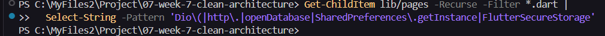
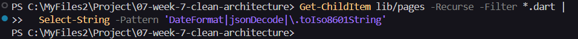
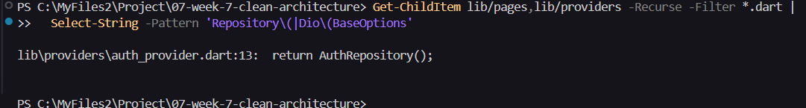
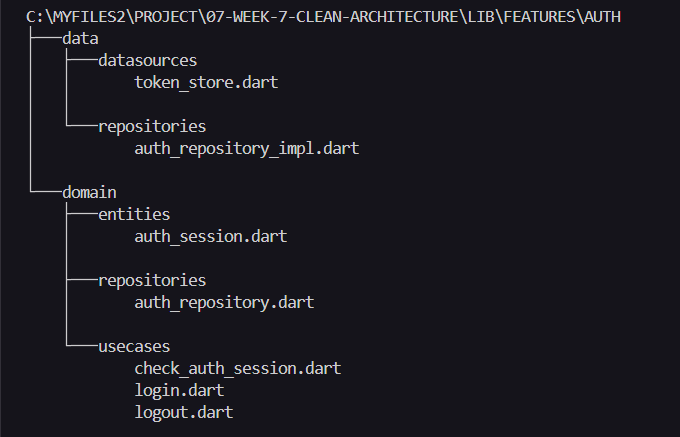
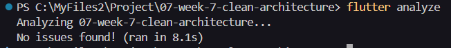
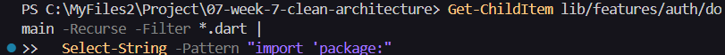

# 07-week-7-clean-architecture

## Tujuan

1. Menjelaskan prinsip SOLID dan separation of concerns dengan contoh kode Flutter.
2. Membedakan struktur feature-first vs layer-first beserta trade-off-nya.
3. Menjelaskan tiga layer (presentation, domain, data) dan aturan dependensi (dependensi mengarah ke dalam).
4. Membedakan entity vs model serta peran repository, use case, dan dependency injection.
5. Merefactor project Minggu 5/6 menjadi struktur feature-first yang terpisah layer-nya.
6. Menguji use case dengan repository palsu tanpa database atau jaringan sungguhan.

## Praktikum 1: Audit Layer Project Lama

| File | Layer saat ini | Masalah / Catatan Audit |
| --- | --- | --- |
| pages/home_page.dart | Presentation | Sudah berfokus pada tampilan, navigasi, dan pemanggilan logout melalui notifier. Tidak ditemukan akses Dio, database, penyimpanan token, parsing JSON, atau pemformatan tanggal di widget. Navigasi sudah menggunakan konstanta AppRoutes. Tidak ditemukan pelanggaran pemisahan layer pada file ini. |
| data/api_client.dart | Data / Infrastruktur jaringan | Mengatur Dio, header autentikasi, dan interceptor refresh token. Masih bergantung pada kelas konkret AuthRepository dan TokenStore. Base URL masih berupa alamat contoh yang ditulis langsung dalam kode. Retry setelah respons 401 belum memiliki batas percobaan sehingga berisiko melakukan refresh berulang. Belum ada pengaturan untuk mencegah beberapa request 401 melakukan refresh secara bersamaan. Pemakaian API client perlu ditelusuri pada file lain untuk memastikan widget tidak mengaksesnya langsung. |
| providers/auth_provider.dart | Presentation (state) + DI | Provider membuat TokenStore dan AuthRepository secara langsung serta menyediakan Dio. AuthNotifier membaca, menyimpan, dan menghapus token langsung melalui TokenStore, sehingga pengelolaan sesi masih bercampur dengan pengelolaan state UI. |
| data/auth_repository.dart | Data + model sesi + logika autentikasi | AuthRepository berupa kelas konkret tanpa interface domain terpisah. AuthSession, validasi input, serta simulasi login dan refresh masih berada dalam satu file. |


Menandai tiga pelanggaran klasik, dengan melakukan grep di project.

Berikut merupakan hasil tiga pola pelanggaran klasik







Pencarian dilakukan menggunakan Select-String pada PowerShell karena rg belum tersedia.

| Pemeriksaan | Lokasi pencarian | Hasil | Catatan |
| --- | --- | --- | --- |
| Akses jaringan/database/penyimpanan langsung pada widget | lib/pages | Tidak ditemukan | Tidak ada kode yang cocok dengan pola pencarian. |
| Pengolahan data pada widget | lib/pages | Tidak ditemukan | Tidak ditemukan DateFormat, jsonDecode, atau .toIso8601String. |
| Instansiasi manual repository atau Dio | lib/pages, lib/providers | auth_provider.dart, baris 13: return AuthRepository(); | Repository konkret dibuat dalam provider yang masih satu file dengan notifier autentikasi. Wiring dependency akan dipisahkan dari pengelolaan state. |

Pembuatan repository dalam provider DI tidak otomatis merupakan pelanggaran. Temuan ini menjadi bahan refactor karena penyusunan dependency dan notifier masih berada dalam satu file. Tidak adanya kecocokan pada pencarian lain juga belum menjamin seluruh pemisahan layer sudah benar.


Gambar struktur target

Refactor difokuskan pada fitur auth yang sudah tersedia pada Campus Notify. Struktur berikut merupakan rencana.

```text
lib/
├── main.dart
├── routes.dart
├── core/
│   ├── failures.dart
│   └── network/
│       ├── api_client.dart
│       └── api_errors.dart
├── features/
│   └── auth/
│       ├── domain/
│       │   ├── entities/
│       │   │   └── auth_session.dart
│       │   ├── repositories/
│       │   │   └── auth_repository.dart
│       │   └── usecases/
│       │       ├── check_auth_session.dart
│       │       ├── login.dart
│       │       └── logout.dart
│       ├── data/
│       │   ├── datasources/
│       │   │   └── token_store.dart
│       │   └── repositories/
│       │       └── auth_repository_impl.dart
│       ├── di/
│       │   └── auth_providers.dart
│       └── presentation/
│           ├── providers/
│           │   └── auth_state_provider.dart
│           └── pages/
│               └── login_page.dart
├── messaging/
│   └── push_service.dart
└── pages/
    ├── announcement_page.dart
    ├── debug_page.dart
    └── home_page.dart
```

AuthSession menjadi entity domain, AuthRepository menjadi kontrak, dan AuthRepositoryImpl menyediakan implementasinya. TokenStore tetap berada pada data. Penyusunan dependency ditempatkan pada folder di, sedangkan notifier dan halaman login berada pada presentation.

Fitur pengumuman dan messaging tetap dipertahankan. Tidak ada fitur notes baru yang ditambahkan.


## Praktikum 2: Domain dan Data per Fitur

Menerapkan pemisahan domain dan data pada fitur auth yang sudah tersedia di Campus Notify. Implementasi autentikasi tetap menggunakan simulasi seperti pada project Minggu 6.

Membuat entity murni

Membuat AuthSession pada lib/features/auth/domain/entities/auth_session.dart untuk menyimpan access token dan refresh token. Entity tidak mengimpor Flutter atau plugin serta tidak melakukan mapping data.

Membuat failure dan kontrak repository

Membuat lib/core/failures.dart yang berisi Failure, LocalFailure, NetworkFailure, dan AuthFailure. Failure digunakan untuk menyampaikan kegagalan melalui pesan tanpa meneruskan exception mentah ke presentation.

Membuat interface AuthRepository pada lib/features/auth/domain/repositories/auth_repository.dart. Kontrak menyediakan operasi checkSession, login, refresh, dan logout.

Hasil operasi menggunakan record Dart yang memuat data hasil dan Failure. Implementasi penyimpanan serta proses autentikasi tidak diletakkan pada kontrak domain.

Membuat implementasi data

Menyalin TokenStore ke lib/features/auth/data/datasources/token_store.dart. File lama pada lib/data/token_store.dart tetap dipertahankan sementara karena masih digunakan oleh provider lama.

Membuat AuthRepositoryImpl pada lib/features/auth/data/repositories/auth_repository_impl.dart untuk mengimplementasikan kontrak AuthRepository. TokenStore diberikan melalui constructor agar dependency penyimpanan tidak dibuat langsung di dalam repository.

Repository menangani pembacaan sesi, penyimpanan token setelah login dan refresh, serta penghapusan token saat logout. Kegagalan penyimpanan dikembalikan sebagai LocalFailure.

Model belum dibuat karena autentikasi masih menggunakan simulasi dan belum memerlukan mapping respons API. Data sesi menggunakan entity AuthSession. Mapping akan ditempatkan pada data layer ketika integrasi API diterapkan.

Membuat use case

Membuat use case pada lib/features/auth/domain/usecases untuk menyediakan operasi autentikasi melalui kontrak repository.

| File | Fungsi |
| --- | --- |
| check_auth_session.dart | Memeriksa keberadaan sesi melalui repository. |
| login.dart | Memvalidasi email dan panjang password sebelum memanggil repository untuk login. |
| logout.dart | Memanggil repository untuk menghapus sesi login. |

Use case Login memiliki aturan validasi sehingga input yang tidak valid tidak diteruskan ke repository. CheckAuthSession dan Logout saat ini meneruskan operasi repository untuk menyediakan alur pemanggilan yang konsisten.

Berikut merupakan struktur domain dan data fitur auth setelah file dibuat.



Melakukan pemeriksaan kode

Menjalankan dart format dan flutter analyze. Memperbaiki saran prefer_initializing_formals dengan menggunakan constructor AuthRepositoryImpl(this._tokenStore).

Berikut merupakan hasil pemeriksaan static analysis setelah perbaikan.



Memeriksa import pada domain menggunakan Select-String. Pencarian import package digunakan untuk memastikan domain tidak bergantung pada Flutter atau plugin.

Berikut merupakan hasil pemeriksaan import domain.



Pada tahap ini, domain dan data baru belum dihubungkan ke presentation. Aplikasi masih menggunakan provider dan repository lama. Penyusunan DI, penghubungan notifier ke use case, serta penghapusan file lama dilakukan pada Praktikum 3.
